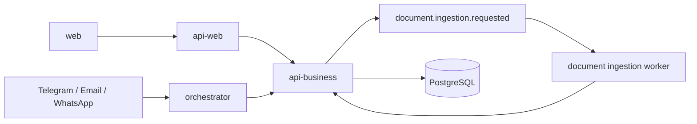

# RAG Platform

[](LICENSE)
[](package.json)
[](docker-compose.yml)
[](.github/workflows/ci.yml)

TypeScript monorepo for an AI agent platform with a queue-driven orchestrator, synchronous business APIs, a presentation/BFF API, and a Next.js web application.

## Monorepo Boundaries

```text
apps/
  web
  api-web
  api-business
  orchestrator

packages/
  contracts
  shared
  sdk
  config
  observability
  types
  utils
```

- `apps/web`
  - user interface, dashboards, chat screens, and document status views
- `apps/api-web`
  - presentation and BFF boundary for portal-facing concerns
- `apps/api-business`
  - synchronous business/domain APIs that already exist in the repository
- `apps/orchestrator`
  - asynchronous runtime for queues, agents, channels, tools, and workers

## Root Structure

The repository root keeps cross-application concerns only:

```text
/
  apps/
  packages/
  docs/
  scripts/
  .github/
  docker-compose.yml
  .env.example
  README.md
  CONTRIBUTING.md
```

- `apps/`
  - deployable applications and runtime boundaries
- `packages/`
  - truly shared contracts, config helpers, SDK clients, observability primitives, and low-level utilities
- `docs/`
  - canonical architecture, ADRs, operational guides, and release documentation
- `scripts/`
  - local developer workflow helpers
- `.github/workflows/`
  - CI and deployment automation
- `docker-compose.yml`
  - local infrastructure and containerized app runtime definition

## Runtime Model

The platform uses two execution styles on purpose:

- chat and message replies stay synchronous when the user needs an immediate answer
- heavy document processing moves to an asynchronous flow

The main runtime path remains:

`Channels -> BullMQ inbound queue -> orchestrator -> agents -> tools -> flow execution -> outbound channel`

Document ingestion now adds a dedicated asynchronous path:

`web or channel origin -> api-business -> RabbitMQ document.ingestion.requested -> orchestrator worker -> persisted status`



## Why Documents Use RabbitMQ

Document parsing, chunking, embeddings, and indexing are heavier than normal chat turns. The repository therefore uses RabbitMQ only for document ingestion so that:

- a web upload can return `202 Accepted`
- a channel conversation does not block while the document is processed
- the UI can poll persisted status instead of waiting for a long-running request

Chat remains synchronous for now. That is intentional and documented.

## RabbitMQ Responsibility Split

RabbitMQ is intentionally split across two levels of the monorepo:

- root-level infrastructure concerns
  - `docker-compose.yml`
  - root and app env examples
  - local startup and operational documentation
- application-level messaging concerns
  - `apps/api-business`
    - publishes `document.ingestion.requested`
  - `apps/orchestrator`
    - consumes and processes `document.ingestion.requested`

This keeps the broker itself as infrastructure while preserving publishers, consumers, queue bindings, and handlers inside the applications that own the runtime behavior.

The document ingestion pipeline now also includes bounded retries, a dedicated dead-letter queue, persisted retry metadata, and an explicit replay path for failed ingestions. Persisted source status remains the source of truth for the UI and for operational recovery.

## Local Development

Infrastructure is expected to run in Docker. Applications are usually run locally in debug mode.

Typical local split:

- Docker: PostgreSQL, Redis, RabbitMQ, Grafana, Prometheus, Loki, Tempo, OpenTelemetry Collector
- Local processes: `api-web`, `api-business`, `orchestrator`, `web`

See:

- [Running Locally](docs/RUNNING_LOCALLY.md)
- [Testing Guide](docs/TESTING_GUIDE.md)

Common root commands:

```bash
npm run ci
npm run build:packages
npm run test:api
npm run test:e2e:api
npm run test:orchestrator
npm run test:web
npm run dev:infra
npm run k8s:render:base
npm run k8s:render:dev
```

## Deployment Model

The repository keeps two infrastructure modes on purpose:

- Docker Compose is the default local development standard
- Kubernetes is the prepared deployment target for shared environments

Local Docker remains the simplest way to run PostgreSQL, Redis, RabbitMQ, and
the observability stack while developers debug the four apps locally.

Kubernetes deployment assets now live under:

```text
k8s/
  base/
  overlays/
    dev/
    staging/
    prod/
```

These manifests only cover the deployable apps:

- `web`
- `api-web`
- `api-business`
- `orchestrator`

Infrastructure dependencies such as PostgreSQL, Redis, RabbitMQ, and
OpenTelemetry Collector are expected to be deployed separately in Kubernetes or
provided as managed services.

## Main Documentation

- [Platform Architecture](docs/ARCHITECTURE.md)
- [Security Architecture](docs/architecture/security-architecture.md)
- [How Security Works](docs/security/how-security-works.md)
- [Architecture Decisions](docs/ARCHITECTURE_DECISIONS.md)
- [Channel Integration](docs/CHANNEL_INTEGRATION.md)
- [Database and Persistence](docs/DATABASE.md)
- [Deployment Guide](docs/deployment/DEPLOYMENT.md)
- [Kubernetes Guide](docs/deployment/KUBERNETES.md)
- [Technical Debt Register](docs/TECHNICAL_DEBT.md)
- [Release Tasks](docs/RELEASE_TASKS.md)

## App Guides

- [web](apps/web/README.md)
- [api-web](apps/api-web/README.md)
- [api-business](apps/api-business/README.md)
- [orchestrator](apps/orchestrator/README.md)

## Current Status

What is solid:

- orchestrator-centered runtime
- channel adapters and queue topology
- document processing worker structure
- persisted document status tracking
- core observability primitives

What is still evolving:

- web alignment with the intended API boundaries
- full end-to-end unification of synchronous and asynchronous RAG paths
- stronger idempotency and multi-tenant hardening

## RabbitMQ Management

When running locally through `docker compose`, RabbitMQ management is available at:

- `http://localhost:15672`
