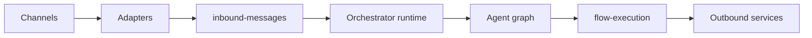

# RAG Platform

[](LICENSE)
[](package.json)
[](docker-compose.yml)
[](.github/workflows/ci.yml)
[](.github/workflows/pr-validation.yml)

TypeScript monorepo for orchestrating AI agents through an asynchronous, queue-based runtime. The platform combines channel integrations, agent-first routing, document ingestion, RAG retrieval, conversation memory, feature toggles, and operational observability.

## What This Project Solves

The platform separates:

- message transport
- business decisions
- technical execution

Instead of embedding business logic in channels, the system centralizes runtime processing in `apps/orchestrator`. Channels normalize external events, `AgentGraphService` decides the execution path, and tools perform operations such as parsing, chunking, embeddings, storage, and retrieval.

## Architecture Overview

The main runtime flow implemented today is:

`Channels -> Channel Adapter -> Inbound Queue -> Orchestrator Runtime -> Supervisor Agent -> Specialized Agents -> Tools -> RAG / Memory -> Response Generation -> Outbound Channel`

Current architectural principles:

- `agent-first`: agents decide runtime behavior
- `channel-agnostic`: channels do not contain business rules
- `orchestrator-centered`: the real runtime lives in `apps/orchestrator`
- `event-driven`: BullMQ queues decouple intake from execution
- `document ingestion async path`: document uploads can be handed off from `apps/api-business` to `apps/orchestrator` through RabbitMQ without changing chat runtime behavior



## Repository Structure

```text
apps/
  api-business
  api-web
  orchestrator
  web

packages/
  config
  contracts
  observability
  sdk
  shared
  types
  utils

docs/
  ARCHITECTURE.md
  ARCHITECTURE_DECISIONS.md
  DATABASE.md
  RUNNING_LOCALLY.md
  TESTING_GUIDE.md
  CHANNEL_INTEGRATION.md
```

## Module Responsibilities

- `apps/api-business`
  - synchronous business APIs for chat, documents, ingestion, search, memory, and internal platform operations

- `apps/api-web`
  - portal-facing APIs for auth, analytics, agent traces, health, omnichannel monitoring, and simulation surfaces

- `apps/orchestrator`
  - asynchronous runtime, queues, agents, tools, RAG, memory, guardrails, feature toggles, tracing, and outbound routing

- `apps/web`
  - dashboards, command center, chat screens, and operational views

- `packages/contracts`
  - canonical contracts and shared events

- `packages/sdk`
  - internal clients used mainly by the orchestrator to talk to the API

- `packages/config`
  - configuration loading and validation

- `packages/observability`
  - logging, metrics, and tracing

## Main Technologies

- NestJS
- Next.js
- BullMQ
- Redis
- RabbitMQ
- PostgreSQL
- OpenTelemetry
- Prometheus
- Grafana
- Tempo
- Loki

## Current Project Status

### Most Stable

- asynchronous runtime in `apps/orchestrator`
- core queue topology
- `AgentGraphService`
- Telegram integration
- primary document pipeline
- retrieval with fallback behavior
- feature toggles with safe degradation
- observability in the critical path

### Still Evolving

- Email and WhatsApp are behind Telegram in maturity
- conversation memory
- vector persistence and retrieval for larger scale
- API hardening as a synchronous boundary

### Not Yet Enterprise-Complete

- centralized end-to-end idempotency
- full enterprise document storage lifecycle
- uniformly hardened multi-tenant isolation across every surface

## Running Locally

See:

- [Running Locally](docs/RUNNING_LOCALLY.md)

## Testing

See:

- [Testing Guide](docs/TESTING_GUIDE.md)

## Channels

See:

- [Channel Integration](docs/CHANNEL_INTEGRATION.md)
- [Telegram Channel](docs/channels/telegram.md)

## Core Documentation

- [Platform Architecture](docs/ARCHITECTURE.md)
- [Architecture Decision Validation](docs/ARCHITECTURE_DECISIONS.md)
- [Database and Persistence](docs/DATABASE.md)
- [Consolidated Technical Report](docs/relatorio-tecnico-consolidado.md)
- [Runtime Flow](docs/runtime-flow.md)
- [RAG Flow](docs/rag/rag-flow.md)

## Publication Notes

This repository already demonstrates a coherent architecture that can be discussed confidently in interviews, architecture reviews, and controlled pilot contexts. At the same time, the documentation intentionally distinguishes what is stable, what is evolving, and what should not yet be described as enterprise-complete.
