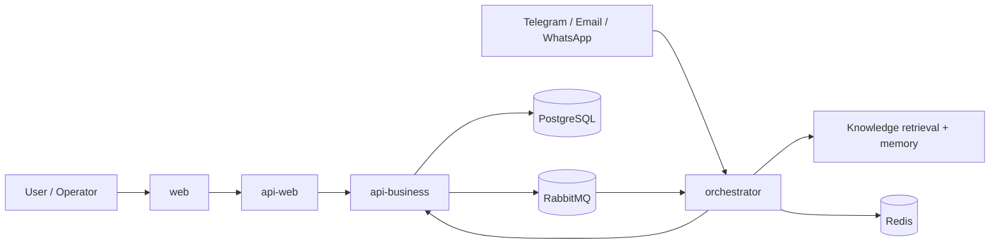
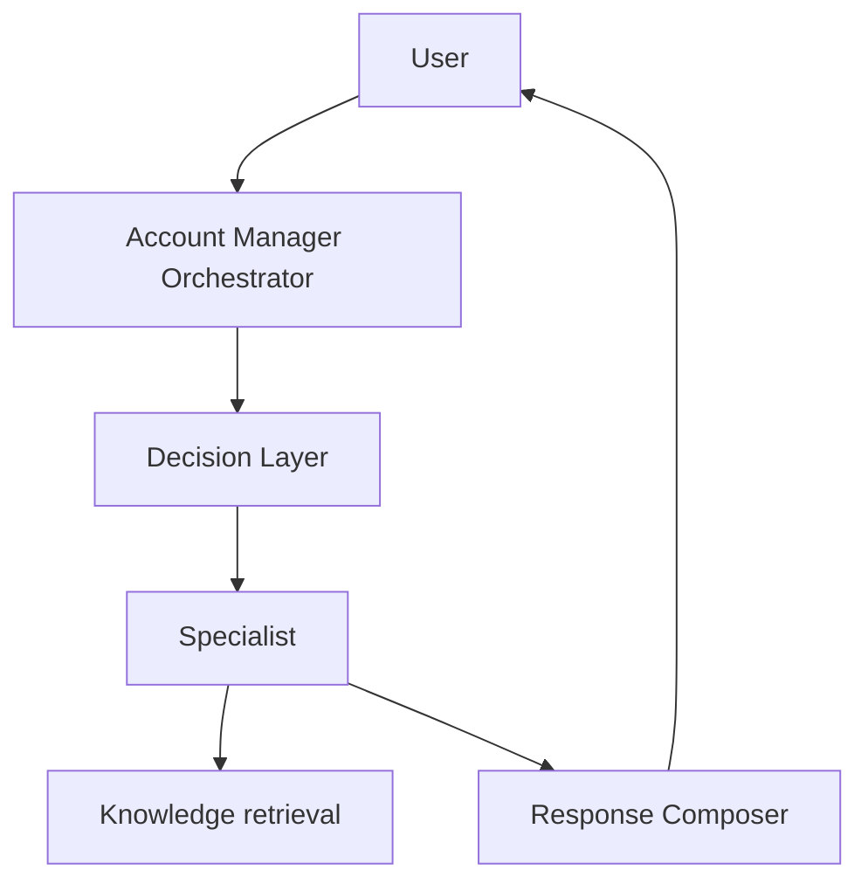
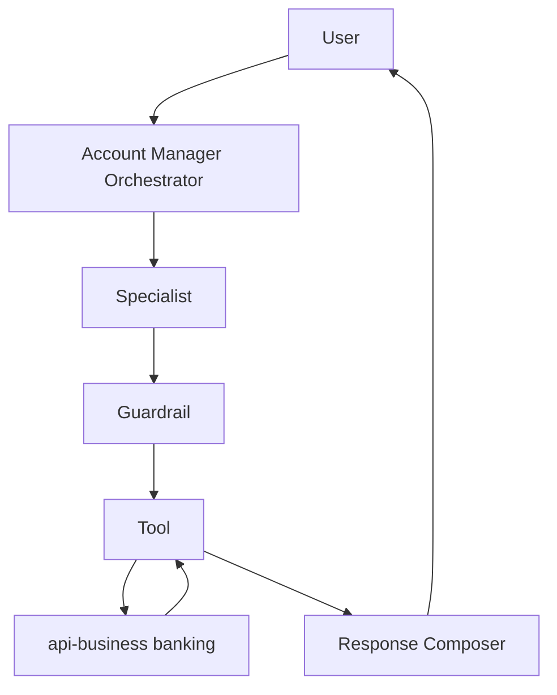

# Intelligent Automation Platform

[](LICENSE)
[](package.json)
[](docker-compose.yml)
[](.github/workflows/ci.yml)

TypeScript monorepo for an intelligent automation platform. The current showcased business scenario is banking, where an AI Account Manager orchestrates specialists, knowledge retrieval, guardrails, handoff, and tool execution backed by real business APIs.

## Current Business Context

The current target scenario is a virtual banking account manager:

- receives customer messages from chat and channels
- classifies intent through a decision layer
- routes to specialists such as cards and investments
- uses RAG for institutional knowledge and product rules
- uses tools for business actions and structured queries
- applies guardrails before sensitive operations
- escalates through a real handoff pipeline when needed

## Monorepo Boundaries

```text
apps/
  web
  api-web
  api-business
  orchestrator

packages/
  contracts
  shared
  sdk
  config
  observability
  types
  utils
```

## Main Applications

- `apps/api-business`
  - synchronous domain and business core
  - owns banking contracts plus reusable platform capabilities such as search, documents, memory, and ingestion
  - now also owns the banking domain with `cards`, `investments`, `customer`, and `credit`
  - now documents a logical separation between `Banking Core` and `AI Platform Capabilities`
- `apps/api-web`
  - presentation and BFF layer for web-facing APIs
  - exposes portal-oriented endpoints and keeps UI concerns out of `api-business`
- `apps/orchestrator`
  - asynchronous runtime and flow coordinator
  - owns decision layer, specialists, tools, guardrails, handoff orchestration, queues, and channel execution
- `apps/web`
  - Next.js user interface
  - provides chat, operational views, document screens, and future banking-facing interaction surfaces

## Architecture Snapshot



## How the Banking Runtime Works

The Account Manager flow in `apps/orchestrator` follows these rules:

- `Knowledge retrieval` serves knowledge
  - FAQs, scripts, policies, product rules, institutional context
- `Tools` execute or query business capabilities
  - card block, card info, investment simulation, customer profile, credit limit
- `Specialists` decide when to use RAG, tools, or both
- `Guardrails` protect sensitive operations
- `Handoff` routes the conversation to the real handoff pipeline
- `Orchestrator` coordinates the full flow and response assembly

## Banking Domains in `api-business`

The `banking` domain currently exposes:

- `cards`
  - card listing, details, limit, invoice, block, unblock
- `investments`
  - product listing, portfolio, simulation, order creation
- `customer`
  - profile and product summary
- `credit`
  - simulation, contracts, limit

These services are currently mock-backed in-memory, but they are exposed through real HTTP contracts and are already consumed by orchestrator tools.

## Domain Boundaries and Messaging

The repository now makes two additional architectural moves explicit:

- `api-business` distinguishes `Banking Core` from `AI Platform Capabilities` logically, without a physical split yet
- RabbitMQ naming and topology are now centrally declared for orchestrator, handoff, ingestion, memory, and banking flows

The current document ingestion binding stays compatible while the broader topology is prepared incrementally.

## Implementation Status

Implemented today:

- orchestrator-centered queue/runtime architecture
- decision layer and banking account manager orchestration
- specialists for cards, investments, FAQ, customer/account, credit, and debt routing
- multi-turn confirmation for sensitive card operations
- real handoff pipeline reuse when banking flows request human escalation
- tool integration from `orchestrator` to `api-business` for cards, investments, customer, and credit
- banking domain in `api-business`
- observability split between knowledge-assisted flows and tool-only flows
- tool-only flows without artificial LLM cost attribution

Still mock or partial:

- banking services in `api-business` still use fixed/in-memory data
- card selection still falls back to a default card when `cardId` is not explicit
- only part of the banking scenario is wired into specialists today
- debt negotiation and broader business actions are not yet connected to real repositories or external systems

## Runtime Flows

Phase 1 style conversational flow:



Phase 2 style business action flow:



## Quick Start

Infrastructure usually runs in Docker while apps run locally:

```bash
npm run dev:infra
npm --prefix apps/api-business run start:debug
npm --prefix apps/api-web run start:debug
npm --prefix apps/orchestrator run start:dev
npm --prefix apps/web run dev
```

Useful commands:

```bash
npm run build:packages
npm --prefix apps/api-business run test -- --runInBand
npm --prefix apps/orchestrator run test -- --runInBand
npm --prefix apps/web run test
```

## Documentation

- [Platform Architecture](docs/ARCHITECTURE.md)
- [Banking Architecture](docs/banking-architecture.md)
- [Runtime Flow](docs/runtime-flow.md)
- [Domain Boundaries and Messaging](docs/architecture/domain-boundaries-and-messaging.md)
- [Observability Guide](docs/observability/OBSERVALITY.md)
- [Roadmap](docs/roadmap/ROADMAP.md)
- [Project Readiness](PROJECT_READINESS.md)
- [Architecture Review](ARCHITECTURE_REVIEW.md)

## App Guides

- [web](apps/web/README.md)
- [api-web](apps/api-web/README.md)
- [api-business](apps/api-business/README.md)
- [orchestrator](apps/orchestrator/README.md)
