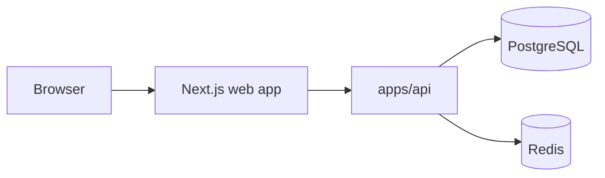

# RAG Platform Web

Frontend application for the monorepo, implemented in `apps/web` with Next.js App Router, TypeScript, and Tailwind CSS.

## Main Routes

- `/dashboard`: operational overview
- `/dashboard/omnichannel`: omnichannel command center
- `/dashboard/omnichannel/requests`: paginated request list
- `/dashboard/omnichannel/requests/[id]`: request and execution details
- `/dashboard/omnichannel/connectors`: connector status and toggle view
- `/chat`: conversational RAG experience
- `/documents`: document upload and management
- `/observability`: health and operational links

## Frontend Topology



## Getting Started

Install dependencies at the repository root and start the development server:

```bash
npm run dev
```

Open [http://localhost:3000](http://localhost:3000).

## Backend Integration

The frontend consumes the NestJS API exposed by the monorepo, including:

- `/health`
- `/metrics`
- `/chat`
- `/documents`
- `/sources`
- `/conversations`
- `/api/v1/omnichannel/*`

Main environment variable:

```bash
NEXT_PUBLIC_API_BASE_URL=http://localhost:3001
```

## Omnichannel Dashboard

The omnichannel UI currently includes:

- overview summary cards
- channel distribution chart
- average and p95 latency chart
- RAG usage widget
- error-rate widget
- recent requests
- paginated request table with filters
- request detail view with execution timeline
- connector list and toggle view
- auto-refresh every 15 seconds

## Scripts

- `npm run dev`
- `npm run build`
- `npm run lint`
- `npm run test`

## Notes

- the backend uses PostgreSQL on port `5433`
- the omnichannel dashboard expects the REST endpoints under `/api/v1/omnichannel`
- the charts use `Recharts`
