# Platform Architecture

## 1. System Overview

This repository implements a TypeScript monorepo for orchestrating AI agents through an asynchronous runtime. External channels normalize inbound events, queues decouple intake from execution, and the orchestrator decides whether the system should answer, ingest a document, retrieve context, or hand off execution.

The current implementation follows these principles:

- `agent-first`: runtime decisions are made through agents
- `channel-agnostic`: channels normalize transport payloads, but do not own business logic
- `orchestrator-centered`: the asynchronous runtime lives in `apps/orchestrator`
- `event-driven`: BullMQ queues decouple message intake from downstream execution

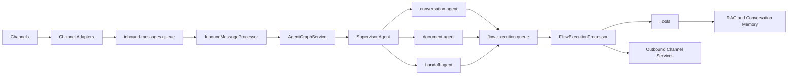

## 2. Monorepo Structure

### Applications

- `apps/api`
  - synchronous NestJS API
  - management, analytics, document, search, memory, health, and administrative surfaces
- `apps/web`
  - Next.js application
  - dashboards, chat screens, omnichannel command center, and operator views
- `apps/orchestrator`
  - asynchronous runtime
  - listeners, adapters, queues, processors, agents, tools, guardrails, traces, and outbound routing

### Packages

- `packages/contracts`
  - canonical contracts, DTOs, events, and queue payload types
- `packages/shared`
  - shared primitives used across applications
- `packages/sdk`
  - internal API clients used mainly by the orchestrator
- `packages/config`
  - configuration helpers and validation utilities
- `packages/observability`
  - logger, metrics, tracing, and observability helpers
- `packages/types`
  - shared platform types
- `packages/utils`
  - shared utility functions

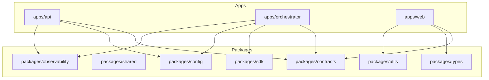

## 3. Core Architecture

The runtime path implemented in the repository is:

`Channels -> Channel Adapter -> Inbound Queue -> Orchestrator Runtime -> Supervisor Agent -> Specialized Agents -> Tools -> RAG / Memory -> Response Generation -> Outbound Channel`

Layer responsibilities:

- `Channels`
  - receive external events
- `Channel Adapter`
  - convert provider payloads into canonical internal payloads
- `Inbound Queue`
  - decouple channel intake from runtime execution
- `Orchestrator Runtime`
  - resolve tenant context, enforce guardrails, emit traces, and run the agent graph
- `Supervisor Agent`
  - choose the specialized agent
- `Specialized Agents`
  - plan document, conversation, or handoff execution
- `Tools`
  - execute technical work such as parsing, chunking, embedding generation, retrieval, and storage
- `RAG / Memory`
  - provide additional context when enabled
- `Response Generation`
  - materialize the downstream execution request and compose the response
- `Outbound Channel`
  - deliver the final response through the right transport service

## 4. Queue Topology

The orchestrator uses two BullMQ queues in the main runtime path.

### `inbound-messages`

- queue constants live in `apps/orchestrator/src/modules/queue/queue.constants.ts`
- receives canonical inbound payloads from channel listeners
- `jobId` is derived from `channel:externalMessageId`
- uses configurable concurrency, attempts, backoff, and retention

### `flow-execution`

- receives the downstream execution request after agent planning
- `jobId` is derived from `jobName:channel:externalMessageId`
- also uses configurable attempts, backoff, and retention

### Retry and DLQ

- both queues use BullMQ retry policies with exponential backoff
- non-final failures remain in the retry path
- final failures are packaged and sent to the Dead Letter Queue service

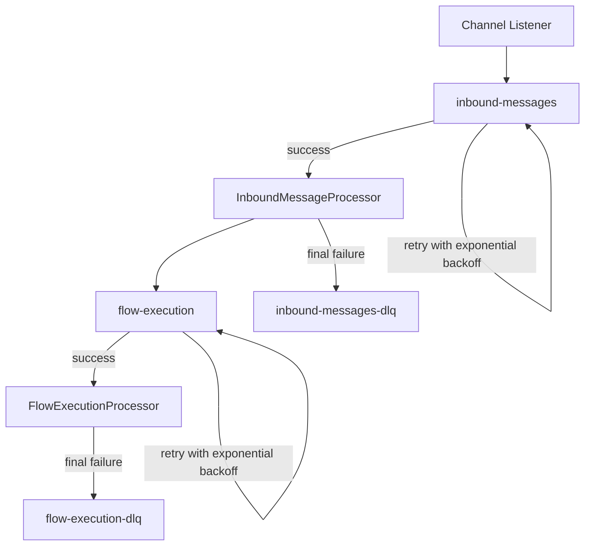

## 5. Orchestrator Runtime

### `InboundMessageProcessor`

`apps/orchestrator/src/modules/processors/inbound-message.processor.ts`

Current responsibilities:

- validate supported inbound job names
- resolve tenant context through `TenantContextMiddleware`
- increment inbound metrics
- run prompt-injection protection
- publish agent trace events
- call `AgentGraphService`
- publish analytics events
- validate policy and action payloads
- optionally run evaluation and cost monitoring
- enqueue the `flow-execution` stage
- package final failures for the inbound DLQ

This worker is operationally effective, but it still concentrates a large amount of orchestration work.

### `FlowExecutionProcessor`

`apps/orchestrator/src/modules/processors/flow-execution.processor.ts`

Current responsibilities:

- handle downstream flow jobs after agent planning
- call response composition logic
- register documents
- route outbound messages
- respect outbound feature toggles
- package final failures for the flow DLQ

### Runtime Message Flow

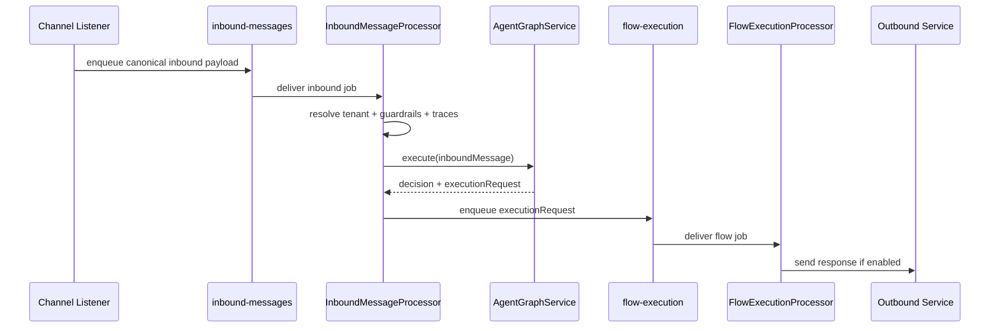

## 6. Agent Graph

`apps/orchestrator/src/modules/agents/agent.graph.ts`

`AgentGraphService` is the coordination layer that turns a canonical inbound message into a downstream execution request.

Execution model:

1. the inbound processor sends the canonical payload to the graph
2. the supervisor selects the target agent
3. the selected agent plans the action and context
4. the graph returns an `executionRequest`
5. the runtime enqueues `flow-execution`

Current specialized agents:

- `SupervisorAgent`
- `conversation-agent`
- `document-agent`
- `handoff-agent`

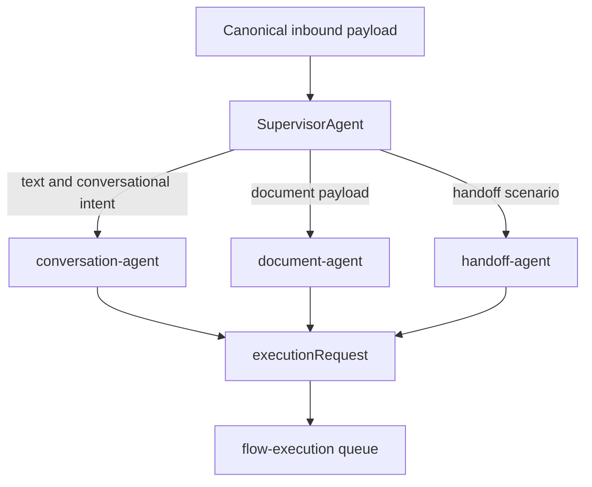

## 7. Channel Integrations

Telegram is the most mature channel in the repository.

Key Telegram components:

- `TelegramInboundAdapter`
- `TelegramPollingService`
- `TelegramListener`
- `TelegramOutboundService`

Current principle:

- channels normalize and publish
- channels do not decide agents
- channels do not perform document ingestion or retrieval
- outbound delivery stays separated from decision logic

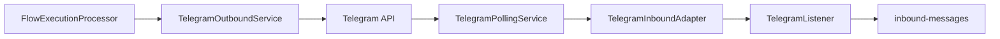

Email and WhatsApp exist in the current architecture, but they are still less mature operationally than Telegram.

## 8. Document Processing Pipeline

Document ingestion is planned by `document-agent` and executed through reusable tools.

What the repository clearly implements today:

- reception of document metadata in canonical inbound payloads
- document-oriented planning through `document-agent`
- download and parsing tools
- chunking and embedding generation
- storage and index registration

What is still evolving:

- full enterprise-grade binary lifecycle management
- stronger reconciliation for partial failures
- broader provider-specific storage hardening

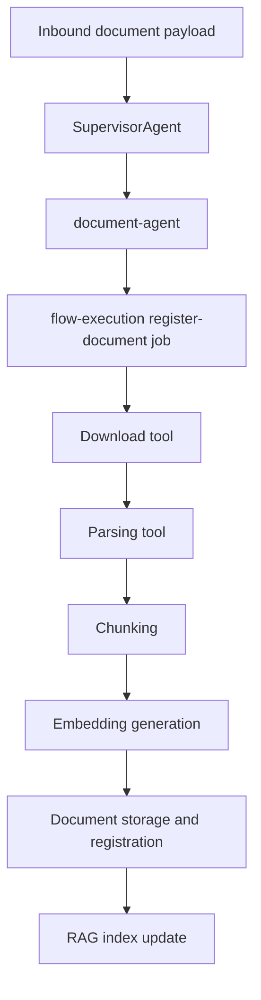

## 9. RAG Architecture

The repository currently supports:

- chunked document storage in PostgreSQL with `pgvector`
- a `documents` table with `VECTOR(1536)` embeddings
- a `rag_documents` table used by the orchestrator-side retrieval path
- retrieval context assembly in the orchestrator
- safe fallback behavior when retrieval is disabled

The vector persistence layer is functional, but still evolving for larger-scale production scenarios.

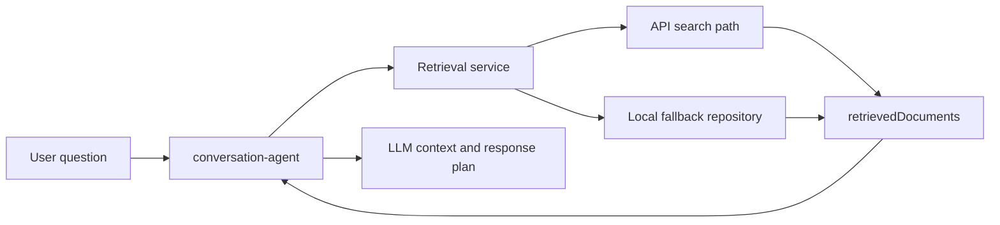

## 10. Conversation Memory

Conversation memory exists as a tenant-aware context store used by the orchestrator when the capability is enabled.

Current state:

- retrieval and persistence logic exist
- memory is integrated into the orchestrator runtime
- memory can be disabled by feature toggle
- the subsystem is still less mature than the core Telegram and queue flows

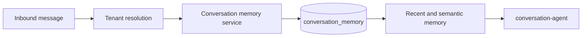

## 11. Feature Toggles

The current runtime supports explicit production-oriented toggles, including:

- `TELEGRAM_ENABLED` / listener-level Telegram settings
- `DOCUMENT_INGESTION_ENABLED`
- `DOCUMENT_PARSING_ENABLED`
- `RAG_RETRIEVAL_ENABLED`
- `CONVERSATION_MEMORY_ENABLED`
- `EVALUATION_ENABLED`
- `OUTBOUND_SENDING_ENABLED`
- `TRAINING_PIPELINE_ENABLED`

Safe degradation behavior already implemented:

- disabled ingestion skips document side effects
- disabled parsing falls back safely
- disabled retrieval returns no retrieved documents
- disabled memory returns empty context
- disabled evaluation skips evaluation side effects
- disabled outbound sending logs and skips delivery

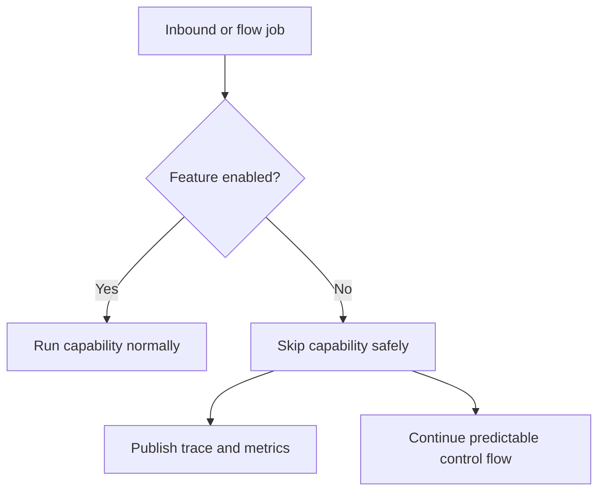

## 12. Observability

The repository includes:

- structured application logging
- Prometheus-style metrics
- OpenTelemetry tracing
- dedicated agent trace events
- queue-related failure and throughput metrics
- cost and evaluation analytics in the orchestrator path

The main observability stack referenced by the repository is:

- OpenTelemetry
- Prometheus
- Grafana
- Tempo
- Loki

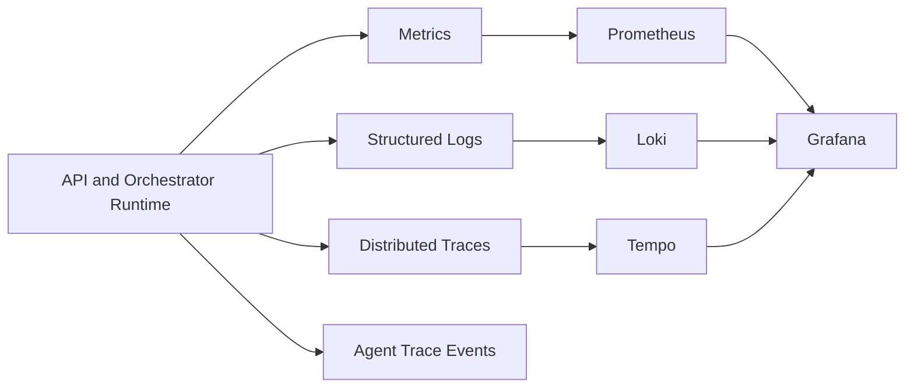

## 13. Testing Strategy

The project includes:

- unit tests
- integration tests
- end-to-end tests for critical flows

Highest-confidence areas today:

- orchestrator critical runtime path
- Telegram-centric runtime behavior
- agent routing
- document ingestion
- RAG retrieval
- feature toggle ON/OFF behavior

Still evolving:

- deeper end-to-end idempotency coverage
- stronger tenant-isolation coverage across all surfaces
- broader API hardening outside the most critical flows

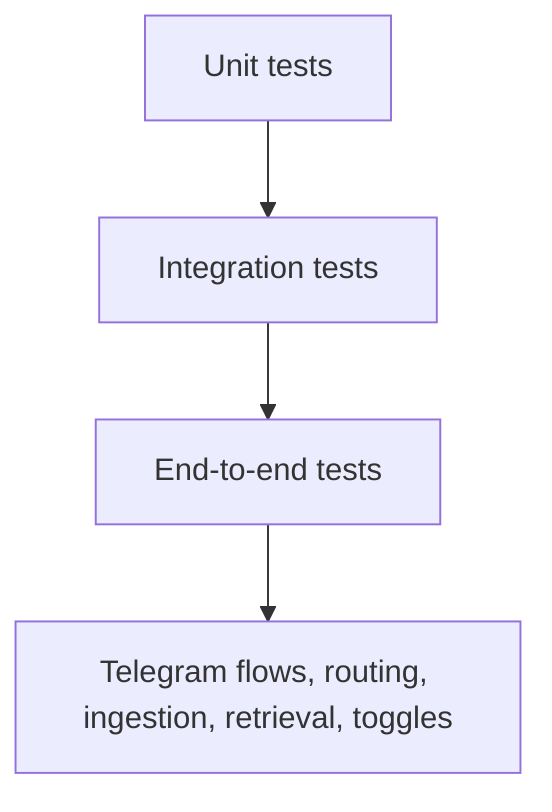

## 14. Current Project Status

### Stable enough for demos and serious pilots

- orchestrator-centered asynchronous runtime
- main queue topology
- Telegram integration
- agent graph and core agents
- observability on the critical path
- feature toggles with safe degradation

### Acceptable but still evolving

- Email and WhatsApp maturity
- conversation memory depth
- document lifecycle hardening
- vector persistence strategy at larger scale
- some synchronous API boundaries

### Not yet enterprise-complete

- centralized end-to-end idempotency
- uniformly hardened tenant isolation across every surface
- full enterprise-grade document lifecycle and reconciliation
- larger-scale retrieval and vector operational hardening
