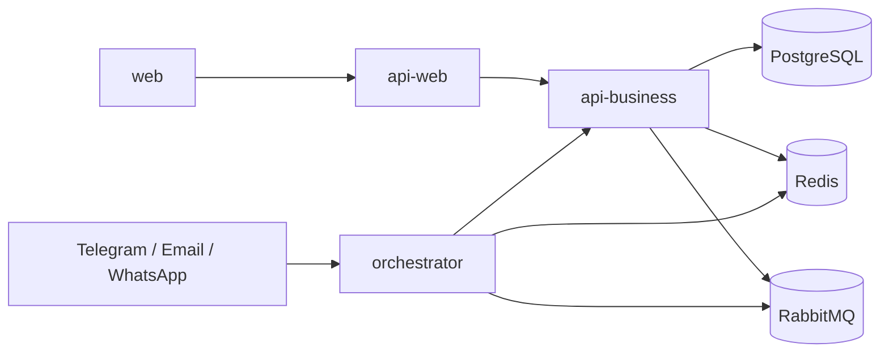
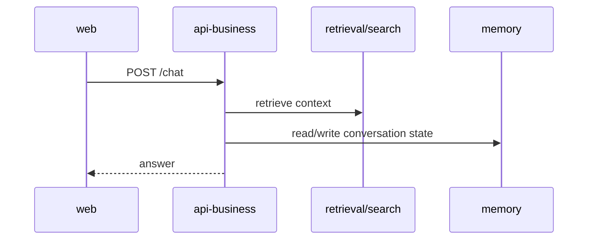
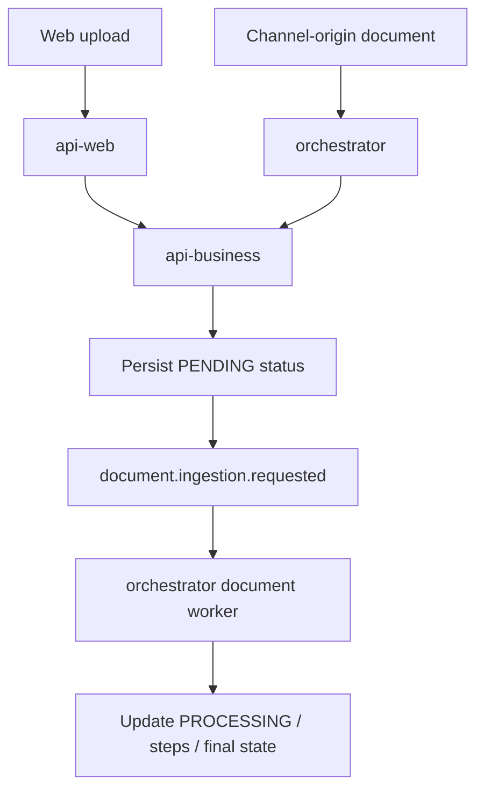
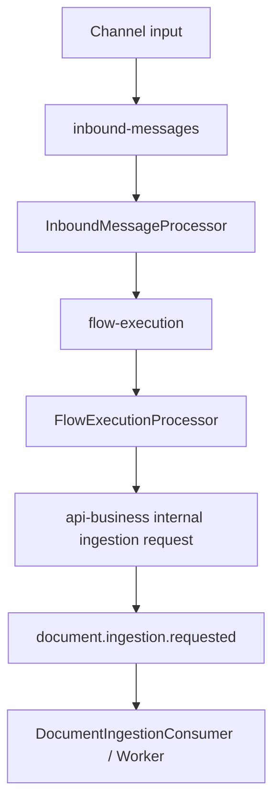
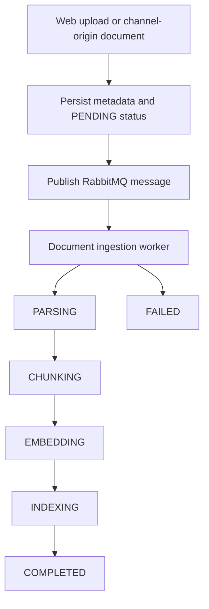

# Platform Architecture

## 1. System Overview

This monorepo implements an AI agent platform with a clear split between UI, synchronous APIs, and the asynchronous runtime.

Current application boundaries:

- `apps/web`
  - user interface
- `apps/api-web`
  - presentation and BFF concerns for the portal
- `apps/api-business`
  - synchronous business/domain capabilities already implemented in the repository
- `apps/orchestrator`
  - asynchronous runtime with queues, agents, channels, and tools

The platform intentionally supports both synchronous and asynchronous execution:

- chat remains synchronous for immediate responses
- heavy document ingestion runs asynchronously through RabbitMQ



## 2. Monorepo Structure

```text
apps/
  web
  api-web
  api-business
  orchestrator

packages/
  contracts
  shared
  sdk
  config
  observability
  types
  utils
```

### Applications

- `apps/web`
  - operator dashboards, chat, documents, status pages, and observability views
- `apps/api-web`
  - BFF and portal-facing endpoints such as omnichannel views, analytics, traces, health, and document proxy endpoints
- `apps/api-business`
  - chat, documents, ingestion, search, conversations, memory, and internal ingestion callbacks
- `apps/orchestrator`
  - BullMQ workers, channel listeners, agent graph, RabbitMQ consumers, tools, and runtime coordination

### Packages

- `packages/contracts`
  - shared contracts and events
- `packages/sdk`
  - internal clients used by the orchestrator and other app boundaries
- `packages/config`
  - environment loaders and helpers
- `packages/observability`
  - logging, metrics, and tracing primitives
- remaining packages
  - low-level shared utilities only

## 3. Synchronous and Asynchronous Flows

### Synchronous Chat Flow

Chat remains synchronous because the current product still expects immediate replies.



### Asynchronous Document Flow

Document ingestion moves to RabbitMQ because parsing, chunking, embeddings, and indexing are heavier operations.



## 4. Queue Topology

The repository currently uses two queue systems for different purposes.

### BullMQ

BullMQ remains the main runtime queue system inside the orchestrator:

- `inbound-messages`
- `flow-execution`

These queues support message intake, agent planning, and downstream response execution.

### RabbitMQ

RabbitMQ is currently introduced only for document ingestion.

- queue: `document.ingestion.requested`
- retry queue: `document.ingestion.requested.retry`
- dead-letter queue: `document.ingestion.requested.dlq`

This queue is intentionally narrow in scope. Chat does not use RabbitMQ.

The current document ingestion worker is hardened with:

- bounded retry attempts
- explicit dead-letter routing after retry exhaustion
- idempotent processing start checks using persisted source status
- replay via persisted source metadata and republishing



## 5. Orchestrator Runtime

The orchestrator remains the asynchronous runtime boundary.

### Core runtime components

- `InboundMessageProcessor`
- `FlowExecutionProcessor`
- `AgentGraphService`
- `SupervisorAgent`
- `conversation-agent`
- `document-agent`
- `handoff-agent`

### Document-specific asynchronous components

- `DocumentIngestionConsumer`
- `DocumentIngestionWorker`
- `DocumentParserService`
- `DocumentChunkingService`
- `DocumentEmbeddingService`

### Runtime responsibilities

- consume canonical inbound messages
- plan execution through agents
- enqueue flow execution
- route outbound responses
- hand off heavy document work to RabbitMQ-backed processing
- update processing status through internal API callbacks

## 6. API Boundaries

### `api-web`

This app owns presentation-oriented APIs, including:

- analytics
- agent traces
- health
- omnichannel monitoring
- simulation
- document upload and status proxy endpoints for the portal

### `api-business`

This app owns the actual repository-backed business capabilities, including:

- chat
- documents
- ingestion
- search
- conversations
- memory
- internal ingestion callbacks used by the orchestrator

### `orchestrator`

This app is not a public HTTP controller surface for end users. It remains the worker/runtime boundary.

## 7. Channel Integrations

Channel integrations remain transport-focused.

Current principle:

- channels normalize inbound events
- channels do not decide business behavior
- documents from channels can still be handed off asynchronously after runtime planning

Telegram remains the most mature channel. Email and WhatsApp exist but are still less mature operationally.

## 8. Document Ingestion Pipeline

Document ingestion can start from two origins:

- web uploads
- channel-origin document messages

Both converge on persisted status and asynchronous worker processing.

### Persisted status model

Current status values:

- `PENDING`
- `PROCESSING`
- `COMPLETED`
- `FAILED`

Current step values:

- `RECEIVED`
- `PARSING`
- `CHUNKING`
- `EMBEDDING`
- `INDEXING`
- `COMPLETED`
- `FAILED`



### Current implementation note

For channel-origin documents, the asynchronous handoff currently uses the text or extracted content already available in the runtime. The repository does not yet implement a brand-new raw-binary channel download subsystem for every provider.

## 9. RAG Architecture

The repository still supports synchronous retrieval and context assembly in the business API and retrieval-oriented execution in the orchestrator.

What exists:

- document parsing and chunking
- embedding generation
- persisted chunks and document metadata
- retrieval/search endpoints
- orchestrator retrieval usage through agents

What is still evolving:

- complete unification of RAG paths
- larger-scale retrieval hardening
- clearer single reference path for all user-facing entry points

## 10. Document Status UI

The web application now includes a document status page:

- route: `/documents/status`

The UI polls persisted status through API endpoints. It does not query RabbitMQ directly.

Why:

- RabbitMQ is a transport mechanism, not the source of truth for UI state
- the UI should render persisted status, current step, timestamps, and safe error messages

## 11. Observability

Current observability patterns include:

- structured logs through shared logging services
- metrics through the shared observability package
- tracing through OpenTelemetry

Document ingestion now adds instrumentation around:

- publish request
- message consumption
- processing start and step transitions
- completion
- failure

Observed metric names in the current repository include:

- `documents_ingestion_requested_total`
- `document_ingestion_consumer_received_total`
- `documents_ingestion_completed_total`
- `documents_ingestion_failed_total`
- `documents_ingestion_duration_ms`

## 12. Testing Strategy

Current useful validation points:

- `apps/api-business`
  - controller/service tests for synchronous business flows
- `apps/api-web`
  - BFF/controller tests
- `apps/orchestrator`
  - runtime, worker, and document-ingestion tests
- `apps/web`
  - UI and feature tests

## 13. Current Project Status

Stable enough to discuss confidently:

- app boundary split
- orchestrator-centered runtime
- BullMQ runtime flow
- RabbitMQ-backed document ingestion worker
- persisted document status query flow

Still evolving:

- cleaner end-to-end alignment of all web flows with `api-web`
- stronger unification of RAG execution paths
- multi-tenant and idempotency hardening
