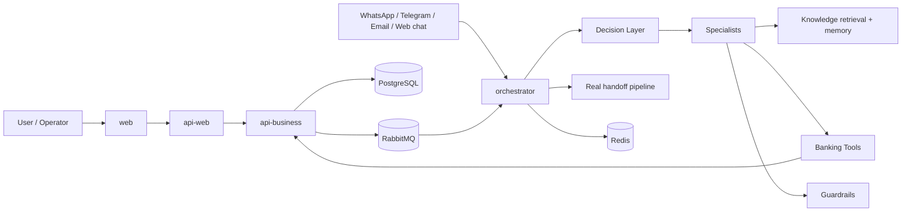

# Platform Architecture

This document describes the current architecture of the repository after the banking scenario evolution.

The project is now positioned as an Intelligent Automation Platform. The main runtime path combines channel handling, orchestration, knowledge retrieval, business APIs, guardrails, observability, and a real handoff pipeline.

## Architectural Principles

- `Knowledge retrieval` provides knowledge, not business execution
- `Tools` execute or query real business capabilities
- `Specialists` decide which capability to use for a given domain
- `Guardrails` protect sensitive flows before execution
- `Orchestrator` coordinates the runtime and composes the final answer
- `api-business` owns business contracts and domain APIs
- `api-web` remains the web-facing BFF and presentation boundary

## Application Boundaries

### `apps/api-business`

Synchronous business core.

- owns domain-oriented HTTP contracts
- exposes banking capabilities used by orchestrator tools
- continues to host existing platform capabilities such as chat, documents, search, memory, and ingestion
- is the current home of the new `banking` domain with `cards`, `investments`, `customer`, and `credit`

### `apps/api-web`

Portal-facing BFF.

- exposes web-oriented APIs
- keeps presentation concerns out of `api-business`
- remains the preferred boundary for web UX and operator-facing workflows

### `apps/orchestrator`

Runtime brain of the platform.

- receives channel-originated work
- runs the supervisor and the banking account manager branch
- classifies intent through the decision layer
- invokes specialists, guardrails, tools, RAG, response composition, and handoff
- integrates with `api-business` through internal tools and gateway clients

### `apps/web`

User and operator interface.

- provides chat and operational screens
- consumes web-facing APIs
- should not own business rules or orchestration logic

## High-Level Architecture

## Current Banking Runtime

The banking runtime is implemented inside `apps/orchestrator` as an additive branch. Existing orchestrator capabilities were preserved and the banking scenario was introduced through:

- `supervisor-agent` routing to the banking branch
- `account-manager-agent`
- `account-manager.orchestrator`
- `decision-layer`
- banking specialists
- banking guardrails
- banking tools
- `response-composer`
- real handoff reuse
- multi-turn confirmation state for sensitive operations

## Decision and Execution Rules

The runtime follows a strict separation:

- use knowledge retrieval for FAQs, institutional policies, product rules, scripts, and contextual knowledge
- use `Tools` for deterministic queries and actions such as card block or investment simulation
- use `Guardrails` to require confirmation and minimum context before sensitive actions
- use `Handoff` when the flow requires human intervention or explicit escalation

This keeps business execution out of prompts and prevents RAG from being used as a substitute for APIs.

## Banking Domains in `api-business`

The `banking` module currently exposes:

- `cards`
  - list cards
  - get card details
  - get limit
  - get invoice
  - block and unblock card
- `investments`
  - list products
  - get portfolio
  - simulate investment
  - create order
- `customer`
  - profile
  - summary
- `credit`
  - simulate credit
  - get contracts
  - get limit

These endpoints already back the orchestrator tools for the current banking flows.

## Logical Separation Inside `api-business`

The repository now makes a logical distinction between two kinds of modules inside `api-business`:

- `Banking Core`
  - `modules/banking/customer`
  - `modules/banking/cards`
  - `modules/banking/investments`
  - `modules/banking/credit`
- `AI Platform Capabilities`
  - `modules/chat`
  - `modules/search`
  - `modules/documents`
  - `modules/ingestion`
  - `modules/memory`
  - `modules/conversations`
  - orchestrator-supporting internal endpoints

This is a logical separation for now. The current physical application layout remains unchanged on purpose.

## Messaging Topology Direction

RabbitMQ topology is now being prepared centrally around domain-oriented naming conventions:

- exchanges by runtime domain or business subdomain
- routing keys by action and state
- queues by consumer workload

Examples:

- `orchestrator.inbound-message`
- `handoff.requested`
- `ingestion.document-requested`
- `memory.store-requested`
- `banking.cards.block-requested`

The active document ingestion flow still uses its existing compatibility binding while the new topology map is adopted incrementally.

## What Is Real Today

Implemented:

- banking decision layer
- banking specialists
- multi-turn confirmation for sensitive card flows
- real handoff pipeline reuse
- tools integrated from orchestrator to `api-business`
- `api-business` banking domain
- observability split between knowledge-assisted flows and tool-only flows

Still mock or partial:

- banking services in `api-business` still use stable in-memory/mock data
- some selection logic still falls back to defaults when the user does not specify an explicit entity such as `cardId`
- only part of the full banking roadmap is wired end-to-end today

## Related Documents

- [Banking Architecture](./banking-architecture.md)
- [Domain Boundaries and Messaging](./architecture/domain-boundaries-and-messaging.md)
- [Runtime Flow](./runtime-flow.md)
- [Observability Guide](./observability/OBSERVALITY.md)
- [Roadmap](./roadmap/ROADMAP.md)
