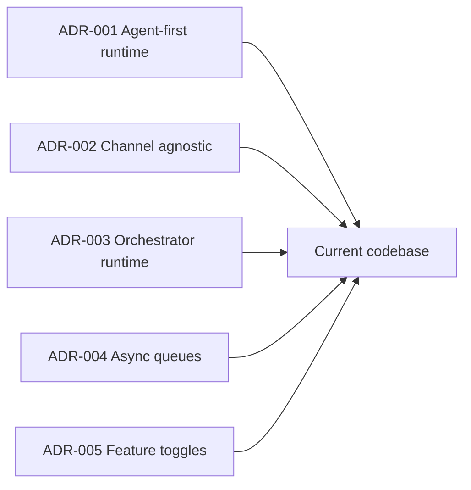
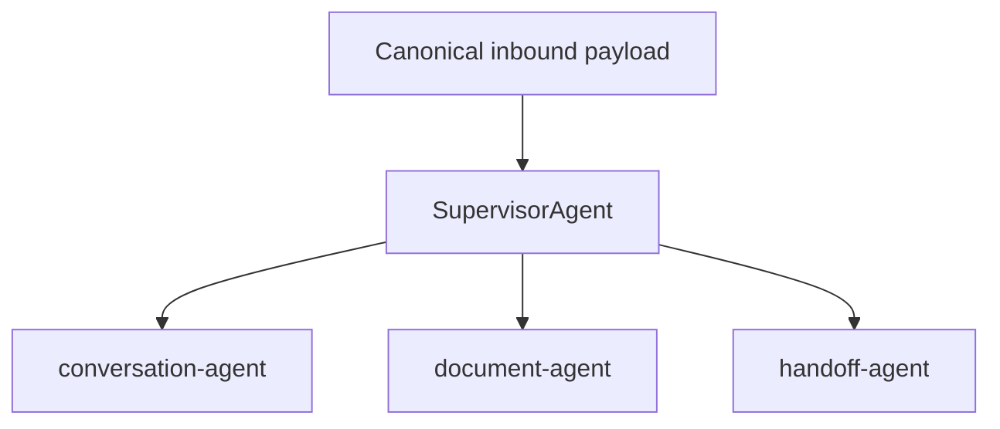
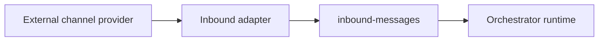
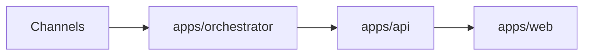
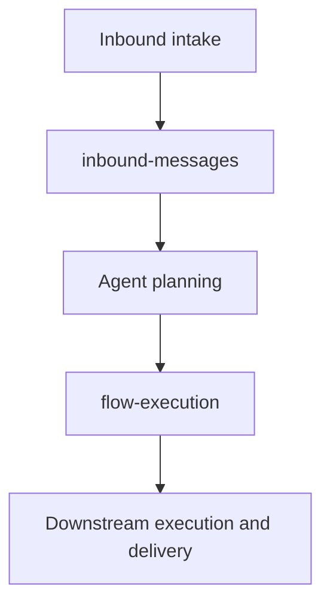
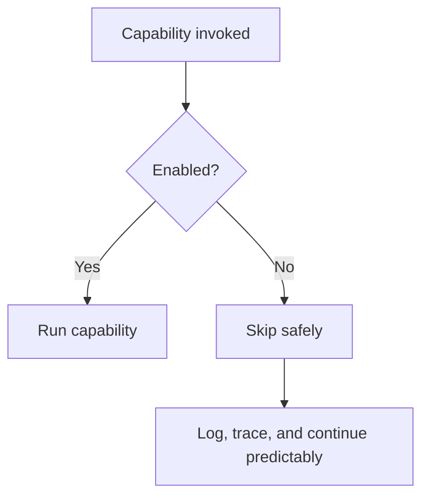

# Architecture Decision Validation

This document validates the architectural direction of the current repository against the implementation that actually exists today.

It complements the historical ADRs under `docs/adr/`, but it is intentionally scoped to the current public codebase.

## Decision Summary

## ADR-001 — Agent-first Runtime

### Intent

The runtime should decide through agents rather than embedding business logic in channels or controllers.

### Validation

The current codebase follows this direction:

- `AgentGraphService` centralizes runtime decisions
- `SupervisorAgent` chooses the target agent
- `conversation-agent`, `document-agent`, and `handoff-agent` plan downstream execution

### Current Drift

The main attention point is not channel logic, but the amount of operational work concentrated in `InboundMessageProcessor`.

### Status

`Aligned, with some operational concentration still evolving`

## ADR-002 — Channel Agnostic

### Intent

Channels should normalize transport payloads without embedding runtime business logic.

### Validation

The current runtime is aligned with this principle:

- Telegram normalizes updates before queueing them
- channel services focus on input and output transport
- agent selection happens in the orchestrator, not in the channel layer

### Current Drift

No major business drift is visible in the channel layer. Telegram-specific logic is mostly limited to transport handling, metrics, and traces.

### Status

`Aligned`

## ADR-003 — Orchestrator Runtime

### Intent

`apps/orchestrator` should be the message runtime, while `apps/api` should remain a synchronous boundary for management, persistence, and queries.

### Validation

This is how the repository behaves today:

- runtime queues, processors, agents, and outbound routing live in `apps/orchestrator`
- `apps/api` exposes synchronous application surfaces such as analytics, documents, search, and administrative endpoints

### Current Drift

No strong evidence shows the API taking over the asynchronous message runtime path.

### Status

`Aligned`

## ADR-004 — Async Queues

### Intent

Message processing should be asynchronous, with explicit decoupling between intake, planning, and downstream execution.

### Validation

The current implementation matches that intent:

- `inbound-messages` handles inbound runtime intake
- `flow-execution` handles the downstream execution stage
- retries, exponential backoff, and DLQ packaging are implemented

### Current Drift

No significant drift is visible. The topology remains intentionally simple.

### Status

`Aligned`

## ADR-005 — Feature Toggles

### Intent

Critical capabilities should be switchable at runtime with safe degradation when disabled.

### Validation

The current orchestrator runtime applies explicit toggles for:

- Telegram listener behavior
- document ingestion
- parsing
- retrieval
- conversation memory
- evaluation
- outbound sending
- training pipeline behavior

### Current Drift

The core runtime is consistent. More granular tenant-scoped or rollout-scoped governance remains an improvement opportunity, not a contradiction of the current architecture.

### Status

`Aligned`

## Overall Reading

Current platform alignment:

- ADR-001 agent-first runtime: aligned
- ADR-002 channel agnostic: aligned
- ADR-003 orchestrator runtime: aligned
- ADR-004 async queues: aligned
- ADR-005 feature toggles: aligned

Current architectural attention points:

- `InboundMessageProcessor` still concentrates a large amount of runtime responsibility
- end-to-end idempotency is still not centralized
- document lifecycle and vector persistence are still evolving for larger-scale production scenarios
