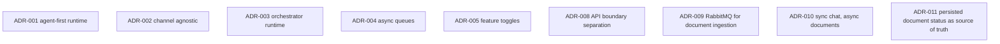

# Architecture Decisions

This document summarizes the architecture decisions that are most relevant to the current public codebase. Historical ADR files remain under `docs/adr/`.

## Current Decision Map

## ADR-001 — Agent-first Runtime

### ADR-001 Intent

Runtime decisions should be made by agents instead of embedding business logic in channels.

### ADR-001 Current Validation

Aligned.

- `AgentGraphService` remains the decision hub
- `SupervisorAgent` selects the target agent
- specialized agents plan the next execution step

### ADR-001 Current Drift

Operational work is still concentrated in `InboundMessageProcessor`, but the runtime model remains agent-first.

## ADR-002 — Channel Agnostic

### ADR-002 Intent

Channels must remain transport-focused.

### ADR-002 Current Validation

Aligned.

- channels normalize inbound events
- channels enqueue canonical payloads
- channels do not own agent choice or retrieval logic

### ADR-002 Current Drift

Telegram is more mature than Email and WhatsApp, but the core principle still holds.

## ADR-003 — Orchestrator Runtime

### ADR-003 Intent

The asynchronous runtime lives in `apps/orchestrator`.

### ADR-003 Current Validation

Aligned.

- BullMQ processors, channel listeners, agents, tools, and document workers remain in the orchestrator
- `api-web` and `api-business` stay outside the async runtime path

## ADR-004 — Async Queues

### ADR-004 Intent

Decouple intake, planning, and downstream execution through queues.

### ADR-004 Current Validation

Aligned.

- BullMQ remains the runtime queue system
- retries and failure handling remain explicit
- RabbitMQ has now been added for a narrow asynchronous document workload

## ADR-005 — Feature Toggles

### ADR-005 Intent

Important capabilities must degrade safely when toggled off.

### ADR-005 Current Validation

Aligned.

The orchestrator still uses runtime toggles for ingestion, parsing, retrieval, memory, outbound sending, and related capabilities.

## ADR-008 — API Boundary Separation

Historical file: [ADR-008](adr/ADR-008-api-boundary-separation.md)

### ADR-008 Intent

Separate portal-facing concerns from synchronous business APIs and from the asynchronous runtime.

### ADR-008 Current Validation

Partially aligned and improving.

- `apps/api-web` now exists as a presentation/BFF boundary
- `apps/api-business` now owns business/domain capabilities
- `apps/orchestrator` remains separate

### ADR-008 Current Drift

Some web flows are still not fully aligned with the intended long-term boundary model. This remains an active technical debt item, not a contradiction of the current direction.

## ADR-009 — RabbitMQ for Document Ingestion

Historical file: [ADR-009](adr/ADR-009-rabbitmq-document-ingestion.md)

### ADR-009 Intent

Introduce RabbitMQ only for heavy document ingestion work.

### ADR-009 Current Validation

Aligned with the current implementation.

- queue: `document.ingestion.requested`
- producer: `apps/api-business`
- consumer: `apps/orchestrator`

### ADR-009 Current Drift

None beyond the deliberate narrow scope.

## ADR-010 — Synchronous Chat, Asynchronous Documents

Historical file: [ADR-010](adr/ADR-010-sync-chat-async-documents.md)

### ADR-010 Intent

Keep immediate message/reply flows synchronous while moving heavy document processing out of the request path.

### ADR-010 Current Validation

Aligned.

- chat remains synchronous
- web and channel-origin documents can be handed off asynchronously

## ADR-011 — Persisted Document Status as Source of Truth

Historical file: [ADR-011](adr/ADR-011-persisted-document-status.md)

### ADR-011 Intent

The UI should observe persisted status, not RabbitMQ internals.

### ADR-011 Current Validation

Aligned.

- `api-business` persists document status and step information
- `api-web` exposes BFF proxy endpoints
- `web` polls persisted status

## Overall Reading

The current architecture is coherent around four boundaries:

- `web`
- `api-web`
- `api-business`
- `orchestrator`

Documents are now explicitly asynchronous when heavy processing is required. Chat remains synchronous. RabbitMQ is intentionally narrow in scope.
