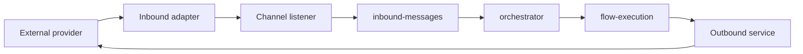
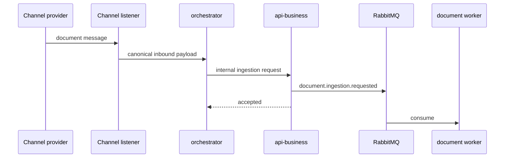

# Channel Integration

This document describes how channels fit into the current architecture.

## Core Principle

Channels remain transport boundaries.

They should:

- receive external events
- normalize payloads into canonical contracts
- enqueue inbound work for the orchestrator
- deliver outbound responses

They should not:

- choose business execution paths directly
- perform document parsing, chunking, or embeddings
- bypass the orchestrator runtime for channel-origin work

## Channel Runtime Flow

## Documents From Channels

Documents can arrive from:

- Telegram
- Email
- WhatsApp
- any other channel already modeled in the runtime

Heavy processing should not block the conversation turn.

Current channel-origin document model:

1. the channel listener publishes the canonical message
2. the orchestrator plans the document action
3. flow execution performs lightweight download/content extraction work
4. the orchestrator requests ingestion through `api-business`
5. `api-business` publishes `document.ingestion.requested`
6. the RabbitMQ-backed worker processes the document asynchronously

## Telegram

Telegram remains the most mature integration.

Main components:

- `TelegramInboundAdapter`
- `TelegramPollingService`
- `TelegramListener`
- `TelegramOutboundService`

## Email

Email has the expected architectural shape, but it is still less mature than Telegram in operational depth.

## WhatsApp

WhatsApp also follows the channel pattern, but it remains behind Telegram in maturity.

## Channel Integration Rules

Any future channel should preserve:

- canonical payload mapping
- no business logic in adapters
- orchestrator-centered execution
- asynchronous handoff for heavy document work
