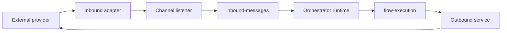
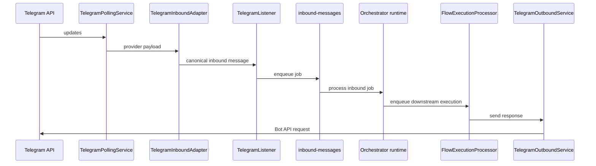
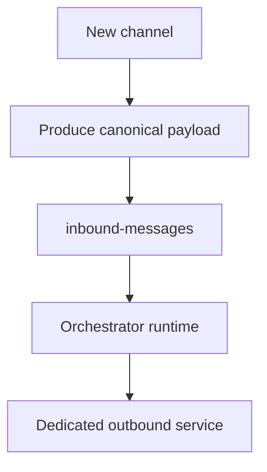

# Channel Integration

This document summarizes how channels integrate with the platform runtime.

## Core Principle

Channels are treated as the transport layer.

They should:

- receive external events
- normalize payloads
- publish canonical messages to the inbound queue
- deliver outbound responses

They should not:

- choose the target agent
- perform document ingestion
- execute retrieval logic
- own runtime business rules

## Channel Integration Model

## Telegram

Telegram is the most mature channel in the repository.

Main runtime components:

- `TelegramInboundAdapter`
- `TelegramPollingService`
- `TelegramListener`
- `TelegramOutboundService`

## Email

Email has adapter, listener, and outbound components in the runtime shape, but it is still less mature operationally than Telegram.

## WhatsApp

WhatsApp also has adapter and listener components, but it remains less mature than Telegram in current operational terms.

## Channel Maturity Reading

- Telegram: most stable
- Email: acceptable but still evolving
- WhatsApp: still evolving

## Guidance for Future Channels

Any new channel should preserve:

- canonical payload mapping
- no business logic in adapters
- orchestrator-centered execution
- dedicated outbound delivery logic
