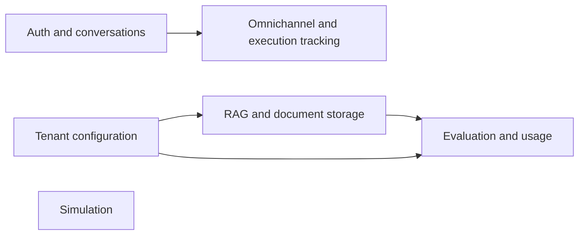
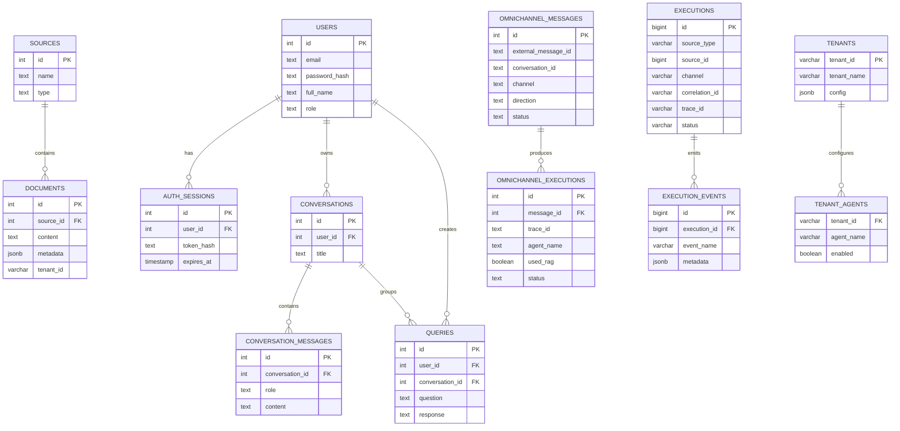
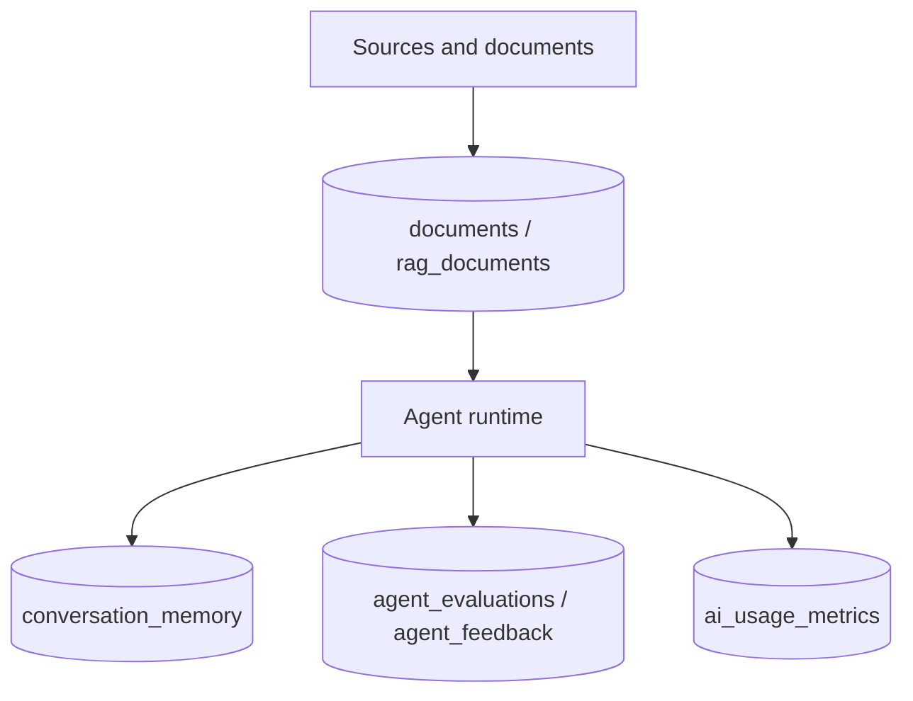
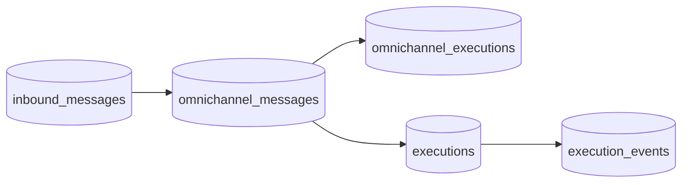

# Database and Persistence

This document describes the database structures that can be verified directly from the SQL migrations in `database/migrations/`.

It intentionally documents only relationships and fields that are explicitly defined in the repository.

## Scope

The repository uses PostgreSQL and enables `pgvector` through migration `01_enable_pgvector.sql`.

The migration set clearly defines these persistence areas:

- knowledge source and chunk storage
- authentication and conversations
- omnichannel messaging and execution tracking
- inbound message journaling
- agent evaluation and feedback
- conversation memory
- tenant and agent enablement
- AI usage metrics
- simulation scenarios and results

## Schema Domains

## Verified Relationships

The migrations explicitly define the following foreign-key relationships:

- `documents.source_id -> sources.id`
- `auth_sessions.user_id -> users.id`
- `conversations.user_id -> users.id`
- `conversation_messages.conversation_id -> conversations.id`
- `queries.user_id -> users.id`
- `queries.conversation_id -> conversations.id`
- `omnichannel_executions.message_id -> omnichannel_messages.id`
- `execution_events.execution_id -> executions.id`
- `tenant_agents.tenant_id -> tenants.tenant_id`

The migrations do **not** define foreign keys for every logical relationship that appears in the application. For example:

- `documents.tenant_id` is indexed, but not declared as a foreign key to `tenants`
- `ai_usage_metrics.tenant_id` is not declared as a foreign key
- `simulation_results.scenario_id` is not declared as a foreign key
- `conversation_memory.conversation_id` is stored as text, not as a foreign key to `conversations`

## Entity Relationship Diagram

## Retrieval and Memory Tables

The migrations also define retrieval and memory-oriented tables without strong relational links to the rest of the schema:

- `rag_documents`
  - content, source, embedding, created timestamp
- `conversation_memory`
  - conversation scope, role, message, embedding, created timestamp
- `agent_evaluations`
  - response-level evaluation scores
- `agent_feedback`
  - response-level human feedback
- `ai_usage_metrics`
  - per-tenant and per-agent token and cost metrics

## Omnichannel and Runtime Tracking

The omnichannel and runtime migrations provide enough verified information to describe this execution-tracking flow:

This diagram represents the persistence surfaces defined by the migrations. It does not claim that every row is always populated in one linear path.

## What This Document Does Not Claim

This repository does **not** provide enough trustworthy information to declare a complete database diagram for every logical relationship in the application code.

In particular, the migrations do not prove:

- a full foreign-key graph for tenant scoping across all tables
- a foreign-key link between simulation results and simulation scenarios
- a strict relational link between `conversation_memory` and `conversations`
- a strict relational link between all usage or evaluation tables and tenants

Those relationships may exist in application logic, but they are not documented here as database facts because the migrations do not define them.
