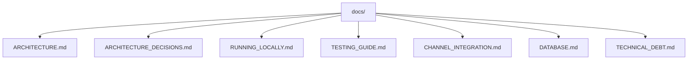

# Project Documentation

This directory contains the canonical technical documentation for the current monorepo.

## Recommended Reading Order

1. [Architecture](ARCHITECTURE.md)
2. [Architecture Decisions](ARCHITECTURE_DECISIONS.md)
3. [Running Locally](RUNNING_LOCALLY.md)
4. [Testing Guide](TESTING_GUIDE.md)
5. [Channel Integration](CHANNEL_INTEGRATION.md)
6. [Database](DATABASE.md)
7. [Technical Debt](TECHNICAL_DEBT.md)

## Current Documentation Map

## Canonical Documents

- [Architecture](ARCHITECTURE.md)
- [Architecture Decisions](ARCHITECTURE_DECISIONS.md)
- [Running Locally](RUNNING_LOCALLY.md)
- [Testing Guide](TESTING_GUIDE.md)
- [Channel Integration](CHANNEL_INTEGRATION.md)
- [Database](DATABASE.md)
- [Technical Debt](TECHNICAL_DEBT.md)
- [Release Tasks](RELEASE_TASKS.md)

## Historical and Supporting Material

- [Historical ADRs](adr/)
- [Runtime Flow](runtime-flow.md)
- [RAG Flow](rag/rag-flow.md)
- [Telegram Channel](channels/telegram.md)
- [Legacy Architecture Reference](architecture/ARCHITECTURE.md)
- [Compatibility Entry](architecture.md)
