# Project Documentation

This directory contains the canonical technical documentation for the current monorepo.

The repository is now documented as an Intelligent Automation Platform with an implemented banking scenario centered on an AI Account Manager in the orchestrator and a `banking` domain in `api-business`.

The messaging documentation also reflects the current pragmatic split:

- BullMQ for the internal conversational runtime
- RabbitMQ for cross-service durable workloads, with document ingestion as the only active flow today
- a shared envelope and topology base ready for the next real RabbitMQ workflow

## Recommended Reading Order

1. [Architecture](ARCHITECTURE.md)
2. [Banking Architecture](banking-architecture.md)
3. [Domain Boundaries and Messaging](architecture/domain-boundaries-and-messaging.md)
4. [Current State Diagnosis](architecture/current-state-diagnosis.md)
5. [RabbitMQ Focused Topology](architecture/rabbitmq-focused-topology.md)
6. [Runtime Flow](runtime-flow.md)
7. [Observability Guide](observability/OBSERVALITY.md)
8. [Architecture Decisions](ARCHITECTURE_DECISIONS.md)
9. [Running Locally](RUNNING_LOCALLY.md)
10. [Security Architecture](architecture/security-architecture.md)
11. [Testing Guide](TESTING_GUIDE.md)
12. [Deployment Model](deployment/DEPLOYMENT.md)
13. [Roadmap](roadmap/ROADMAP.md)

## Documentation Map

```mermaid
flowchart TD
    Docs[docs/] --> Architecture[ARCHITECTURE.md]
    Docs --> Banking[banking-architecture.md]
    Docs --> Boundaries[architecture/domain-boundaries-and-messaging.md]
    Docs --> Diagnosis[architecture/current-state-diagnosis.md]
    Docs --> Rabbit[architecture/rabbitmq-focused-topology.md]
    Docs --> Runtime[runtime-flow.md]
    Docs --> Observability[observability/OBSERVALITY.md]
    Docs --> Decisions[ARCHITECTURE_DECISIONS.md]
    Docs --> Local[RUNNING_LOCALLY.md]
    Docs --> Security[architecture/security-architecture.md]
    Docs --> Deployment[deployment/DEPLOYMENT.md]
    Docs --> Roadmap[roadmap/ROADMAP.md]
```

## Core Documents

- [Architecture](ARCHITECTURE.md)
- [Banking Architecture](banking-architecture.md)
- [Domain Boundaries and Messaging](architecture/domain-boundaries-and-messaging.md)
- [Current State Diagnosis](architecture/current-state-diagnosis.md)
- [RabbitMQ Focused Topology](architecture/rabbitmq-focused-topology.md)
- [Runtime Flow](runtime-flow.md)
- [Observability Guide](observability/OBSERVALITY.md)
- [Architecture Decisions](ARCHITECTURE_DECISIONS.md)
- [Running Locally](RUNNING_LOCALLY.md)
- [Testing Guide](TESTING_GUIDE.md)
- [Deployment Model](deployment/DEPLOYMENT.md)
- [Roadmap](roadmap/ROADMAP.md)
- [Technical Debt](TECHNICAL_DEBT.md)

## Compatibility and Historical References

- [Compatibility architecture entry](architecture.md)
- [Legacy architecture reference](architecture/ARCHITECTURE.md)
- [Observability compatibility entry](observability/OBSERVABILITY.md)
- [Historical ADRs](adr/)
