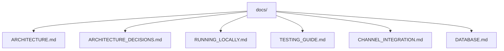

# Project Documentation

This directory contains the public technical documentation for the repository.

The documentation strategy is:

- describe only what the code and migrations actually implement
- mark evolving areas explicitly
- reduce duplication
- keep a small set of canonical entry points

## Documentation Map

## Canonical Documents

- [Platform Architecture](ARCHITECTURE.md)
- [Architecture Decision Validation](ARCHITECTURE_DECISIONS.md)
- [Running Locally](RUNNING_LOCALLY.md)
- [Testing Guide](TESTING_GUIDE.md)
- [Channel Integration](CHANNEL_INTEGRATION.md)
- [Database and Persistence](DATABASE.md)

## Supporting Documents

- [Consolidated Technical Report](relatorio-tecnico-consolidado.md)
- [Runtime Flow](runtime-flow.md)
- [RAG Flow](rag/rag-flow.md)
- [Telegram Channel](channels/telegram.md)
- [Conversation Memory](architecture/conversation-memory.md)
- [Feature Flags](architecture/feature-flags.md)
- [Multi-Tenancy](architecture/multi-tenancy.md)

## Historical Material

- [Historical ADRs](adr/)
- [Legacy Architecture Reference](architecture/ARCHITECTURE.md)
- [Legacy Compatibility Entry](architecture.md)

## Database Sources

The database documentation is derived from:

- [Database Migration Directory](/home/cicero/projects/rag-platform/database)
- [Database README](/home/cicero/projects/rag-platform/database/README.md)

## Recommended Reading Order

1. [Platform Architecture](ARCHITECTURE.md)
2. [Architecture Decision Validation](ARCHITECTURE_DECISIONS.md)
3. [Database and Persistence](DATABASE.md)
4. [Running Locally](RUNNING_LOCALLY.md)
5. [Testing Guide](TESTING_GUIDE.md)
