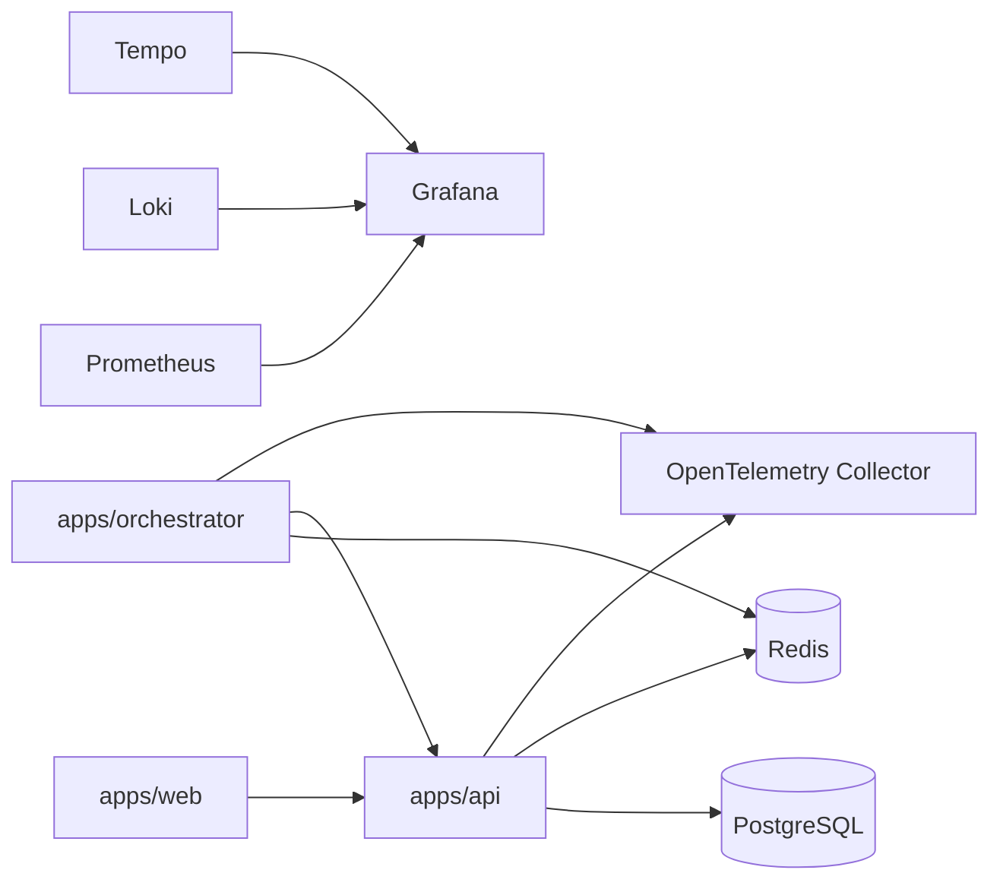
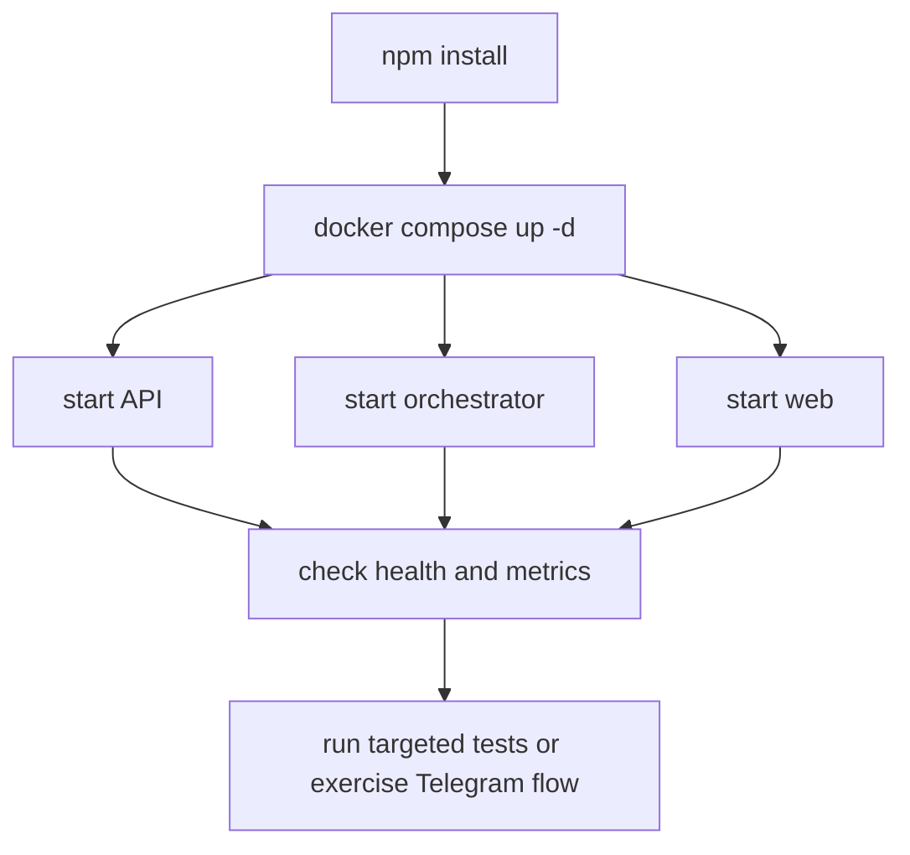

# Running Locally

This guide summarizes the local development setup that matches the repository as it exists today.

## Prerequisites

- Node.js 20.x
- npm
- Docker and Docker Compose

## Local Topology



## 1. Install Dependencies

From the repository root:

```bash
npm install
```

## 2. Start Local Infrastructure

```bash
docker compose up -d
```

The compose stack currently includes:

- PostgreSQL
- Redis
- Prometheus
- Grafana
- Loki
- Promtail
- OpenTelemetry Collector
- Tempo

## 3. Start the Applications

Use separate terminals.

### API

```bash
npm --prefix apps/api run start:dev
```

### Orchestrator

```bash
npm --prefix apps/orchestrator run start:dev
```

### Web

```bash
npm --prefix apps/web run dev
```

## 4. Environment Notes

Environment values differ by application, but the most important local runtime details are:

- PostgreSQL defaults to `localhost:5433`
- Redis defaults to `localhost:6379`
- the orchestrator requires queue and internal API settings
- Telegram requires explicit credentials when the listener is enabled

Example Telegram-related environment values:

```env
TELEGRAM_ENABLED=true
TELEGRAM_BOT_TOKEN=...
TELEGRAM_BOT_USERNAME=...
```

If Telegram is enabled without credentials, the orchestrator will fail fast during startup.

## 5. Recommended Validation Flow



Recommended minimum validation:

1. start infrastructure
2. start `api`, `orchestrator`, and `web`
3. check health endpoints
4. run the most relevant test commands or exercise the mature Telegram path

## 6. Honest Scope Note

The current repository is strongest in:

- the orchestrator runtime
- Telegram integration
- queue-driven execution

Email and WhatsApp exist in the architecture, but they are still less mature operationally than Telegram.
