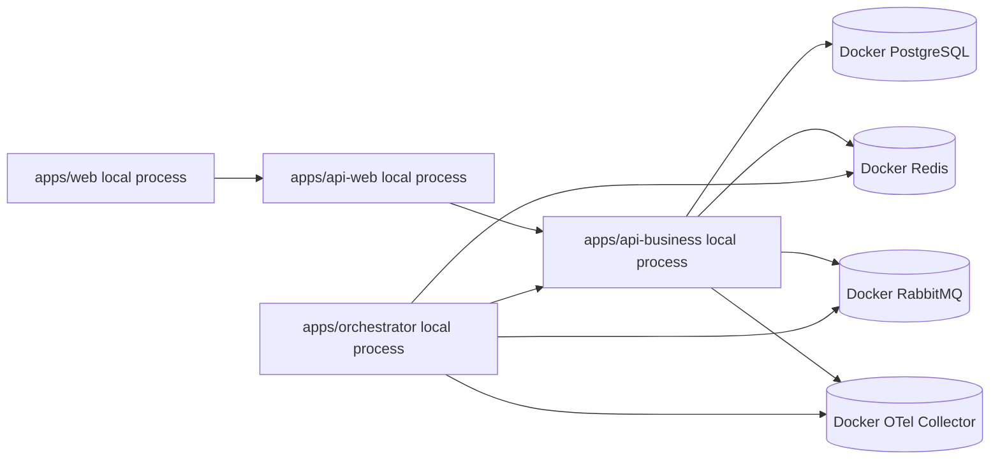
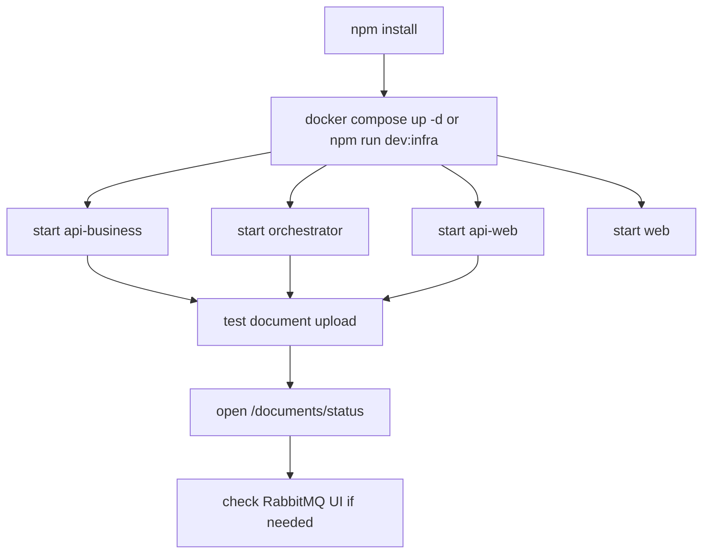

# Running Locally

This guide describes the local development setup that matches the current repository.

## Development Model

Use Docker for infrastructure only. Run the applications locally in debug mode.



## Prerequisites

- Node.js 20.x
- npm
- Docker with Compose

## 1. Install Dependencies

From the repository root:

```bash
npm install
```

## 2. Start Infrastructure

If you want the whole stack:

```bash
docker compose up -d
```

If you want infrastructure only for local debug:

```bash
npm run dev:infra
```

That keeps infrastructure containers running and leaves the applications to VSCode or terminal debug sessions.

Current infrastructure services:

- PostgreSQL
- Redis
- RabbitMQ
- Grafana
- Prometheus
- Loki
- Promtail
- Tempo
- OpenTelemetry Collector

## 3. Start the Applications

Use separate terminals.

### api-business

```bash
npm --prefix apps/api-business run start:debug
```

### api-web

```bash
npm --prefix apps/api-web run start:debug
```

### orchestrator

```bash
npm --prefix apps/orchestrator run start:dev
```

### web

```bash
npm --prefix apps/web run dev
```

## 4. Important Local Endpoints

- web: `http://localhost:3000`
- api-web: your configured local Nest port
- api-business: your configured local Nest port
- RabbitMQ management: `http://localhost:15672`
- Prometheus: `http://localhost:9090`
- Grafana: `http://localhost:3002`

## 5. Environment Notes

Important RabbitMQ variables:

```env
RABBITMQ_HOST=localhost
RABBITMQ_PORT=5672
RABBITMQ_USER=guest
RABBITMQ_PASS=guest
RABBITMQ_QUEUE_DOCUMENT_INGESTION=document.ingestion.requested
```

Important orchestrator-to-business API values:

```env
INTERNAL_API_BASE_URL=http://localhost:3001
INTERNAL_API_INGESTION_REQUEST_PATH=/api/v1/internal/ingestion/request
INTERNAL_API_INGESTION_STATUS_PATH=/api/v1/internal/ingestion/status
INTERNAL_API_INGESTION_COMPLETE_PATH=/api/v1/internal/ingestion/complete
INTERNAL_API_INGESTION_FAIL_PATH=/api/v1/internal/ingestion/fail
```

Telegram note:

- if Telegram is enabled without valid bot credentials, the orchestrator will fail fast during startup

## 6. Recommended Local Validation



## 7. How to Test Async Document Ingestion Locally

### Web-origin document

1. start the four local apps
2. open the documents UI
3. upload a file
4. confirm `202 Accepted`
5. open `/documents/status`
6. watch status move from `PENDING` to `PROCESSING` to `COMPLETED` or `FAILED`

### Channel-origin document

1. enable the relevant channel integration
2. send a document through the channel
3. confirm the conversation is not blocked waiting for indexing
4. check persisted status through the API or web status page
