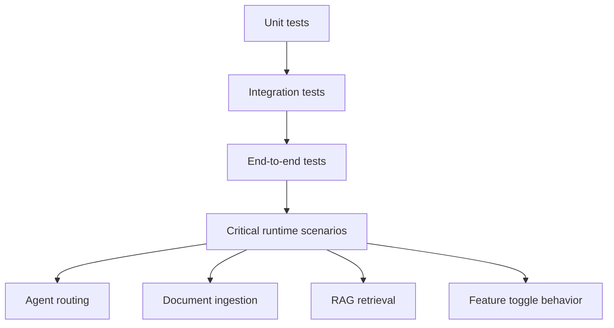
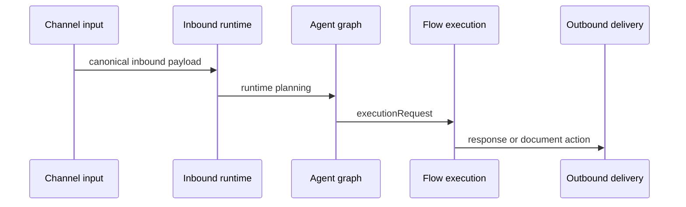

# Testing Guide

This guide summarizes the current test strategy and the most useful validation commands in the repository.

## Current Testing Shape

- unit tests
- integration tests
- end-to-end tests for critical runtime paths

## Test Confidence by Area

Highest confidence currently exists in:

- `apps/orchestrator`
- Telegram-centric runtime behavior
- `AgentGraphService`
- document ingestion
- RAG retrieval
- feature toggle ON/OFF behavior in the orchestrator

Areas still evolving:

- broader API hardening
- stronger end-to-end duplicate event coverage
- stronger tenant-isolation coverage across all surfaces

## Testing Flow



## Useful Commands

From the repository root:

### Coverage

```bash
npm run coverage:api
npm run coverage:orchestrator
npm run coverage:web
```

### Orchestrator

```bash
npm --prefix apps/orchestrator run test -- --runInBand
npm --prefix apps/orchestrator run test:cov:ci
```

### API

```bash
npm --prefix apps/api run test -- --runInBand
npm --prefix apps/api run test:e2e -- --runInBand
npm --prefix apps/api run test:cov:ci
```

### Web

```bash
npm --prefix apps/web run lint
npm --prefix apps/web run test
npm --prefix apps/web run test:coverage
```

## Critical Path Scenarios



Prioritize validation of:

- Telegram inbound mapping
- supervisor routing
- document ingestion
- indexed-document retrieval
- flow execution
- feature toggle behavior with both enabled and disabled states

## Honest Reading of the Current State

- confidence is high in the critical orchestrator runtime path
- the API is improving, but remains less mature than the orchestrator in overall confidence
- duplicate event handling and tenant isolation still deserve stronger end-to-end validation
