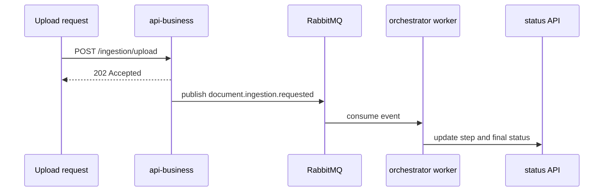

# Testing Guide

This guide summarizes the current testing approach and the most relevant commands after the repository reorganization.

## Current Test Shape

- unit tests
- integration-style module tests
- API e2e tests
- orchestrator runtime tests
- frontend feature tests

## Confidence by Boundary

Highest confidence:

- `apps/orchestrator`
- document ingestion worker flow
- BullMQ runtime behavior
- web document UI and status polling behavior

Good but still evolving:

- `apps/api-business`
- `apps/api-web`

Still worth strengthening further:

- end-to-end tenant isolation
- duplicate event handling and idempotency
- complete web alignment with `api-web`

## Recommended Validation Commands

### Root

```bash
npm run ci
```

### api-business

```bash
npm --prefix apps/api-business run lint
npm --prefix apps/api-business run build
npm --prefix apps/api-business run test -- --runInBand
npm --prefix apps/api-business run test:e2e -- --runInBand
```

### api-web

```bash
npm --prefix apps/api-web run lint
npm --prefix apps/api-web run build
npm --prefix apps/api-web run test -- --runInBand
```

### orchestrator

```bash
npm --prefix apps/orchestrator run lint
npm --prefix apps/orchestrator run build
npm --prefix apps/orchestrator run test -- --runInBand
```

### web

```bash
npm --prefix apps/web run lint
npm --prefix apps/web run test
npm --prefix apps/web run build
```

## Async Document Ingestion Validation



Validate at least:

- upload returns `202 Accepted`
- initial persisted status is `PENDING`
- worker transitions to `PROCESSING`
- `currentStep` progresses when applicable
- final state becomes `COMPLETED` or `FAILED`

## Manual Regression Checklist

- upload a document from the web
- verify `/documents/status`
- verify RabbitMQ consumer logs
- verify channel-origin document handoff still acknowledges without blocking
- verify chat still works synchronously

## Honest Note

The repository is strong on runtime and structural validation. The biggest remaining gaps are around broader cross-boundary e2e coverage, not around the basic build/testability of the current architecture.
