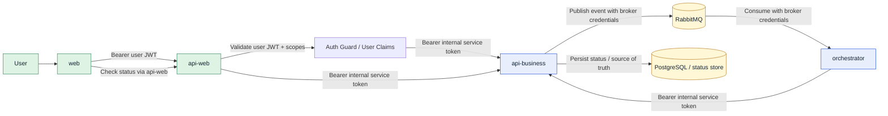
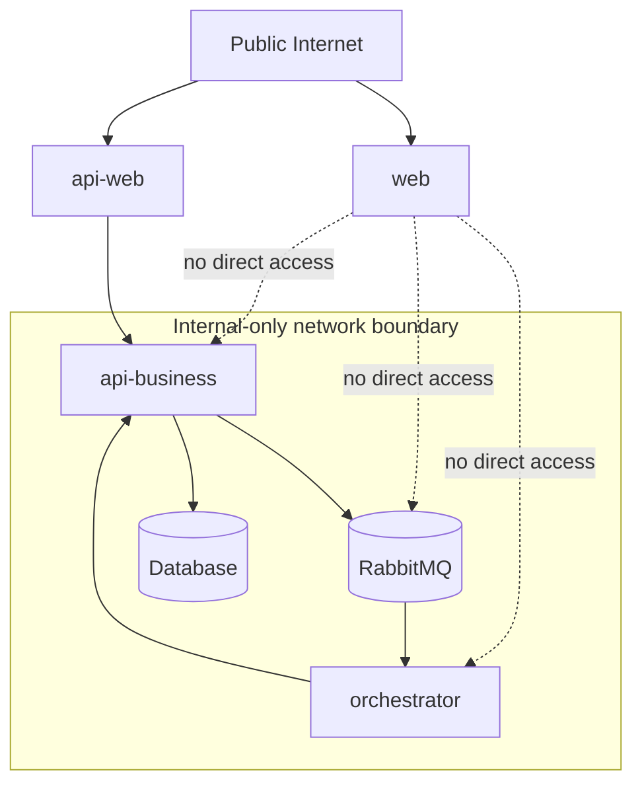

# Security Architecture

This document explains the implemented security model across the monorepo without changing the current runtime boundaries.

## Security Responsibilities by App

- `apps/web`
  - browser UI only
  - stores and forwards the user access token for calls to `api-web`
- `apps/api-web`
  - public edge
  - validates end-user JWTs
  - enforces user scopes before invoking downstream business operations
  - signs internal service tokens when calling `api-business`
- `apps/api-business`
  - internal business API
  - validates internal service tokens for service-to-service traffic
  - still supports session-based auth where compatibility is still required
  - protects internal controllers with explicit service scopes
- `apps/orchestrator`
  - internal worker/runtime boundary
  - does not expose public business endpoints
  - authenticates to `api-business` with an internal service token
  - uses RabbitMQ with broker credentials instead of user tokens

## Technical Security Flow



## Boundary and Exposure Model



## Token Model

### Edge user token

Validated in `api-web`.

- `type=user`
- `iss=rag-platform-api-web`
- `aud=rag-platform-web`
- `sub=<user id>`
- `role=<admin|user>`
- `scopes=[...]`
- `iat`
- `exp`

### Internal service token

Validated in `api-business`.

- `type=service`
- `iss=rag-platform-internal`
- `aud=rag-platform-api-business`
- `sub=service-api-web` or `service-orchestrator`
- `scope=<space separated internal scopes>`
- `iat`
- `exp`

## Internal Service Scopes

Current internal scopes are intentionally explicit:

- `business:documents:read`
- `business:documents:write`
- `internal:conversations:write`
- `internal:documents:write`
- `internal:handoff:write`
- `internal:ingestion:write`
- `internal:memory:write`

## RabbitMQ Security Model

RabbitMQ is not authenticated with user JWTs.

- `api-business` publishes with broker credentials
- `orchestrator` consumes with broker credentials
- credentials are environment-driven
- per-service overrides are supported:
  - `RABBITMQ_API_BUSINESS_USER` / `RABBITMQ_API_BUSINESS_PASS`
  - `RABBITMQ_ORCHESTRATOR_USER` / `RABBITMQ_ORCHESTRATOR_PASS`
- generic fallbacks remain available for local simplicity:
  - `RABBITMQ_USER`
  - `RABBITMQ_PASS`

Important configuration note:

- keep `INTERNAL_SERVICE_TOKEN_SECRET`, issuer, audience, and allowed subjects shared across services
- do not set a single shared `INTERNAL_SERVICE_SUBJECT` or `INTERNAL_SERVICE_DEFAULT_SCOPES` at the repository root unless the environment system supports app-specific overrides
- `api-web` and `orchestrator` intentionally use different defaults for subject and scopes

Operational principle:

- keep RabbitMQ internal-only
- restrict publisher and consumer permissions in the broker when deploying outside local Docker
- never expose RabbitMQ directly to browsers or public ingress

## Security Folder Structure

The security layer is intentionally app-local where responsibilities differ.

- `api-web`
  - edge auth for end users
- `api-business`
  - internal service auth and protected business/internal controllers
- `orchestrator`
  - internal service identity for callbacks to `api-business`

There is no `packages/security` package in the current codebase because that
would centralize abstractions that are still meaningfully different across the
apps.

```text
apps/
  api-web/
    src/
      common/
        auth/
          constants/
          interfaces/
          services/
          utils/
        decorators/
      modules/
        auth/
          guards/

  api-business/
    src/
      common/
        auth/
          constants/
          guards/
          interfaces/
          services/
          utils/
        decorators/

  orchestrator/
    src/
      common/
        auth/
          services/
          utils/
```

## Operational Notes

- `api-web` is the edge enforcement point for end-user identity and scopes.
- `api-business` does not trust network location alone and validates internal service tokens itself.
- `orchestrator` remains queue-driven; its HTTP health probes are operational endpoints and must stay internal-only, not ingress-exposed.
- RabbitMQ security is broker-level, not user-level.
