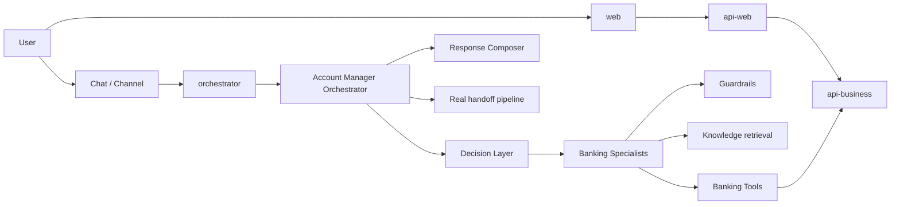
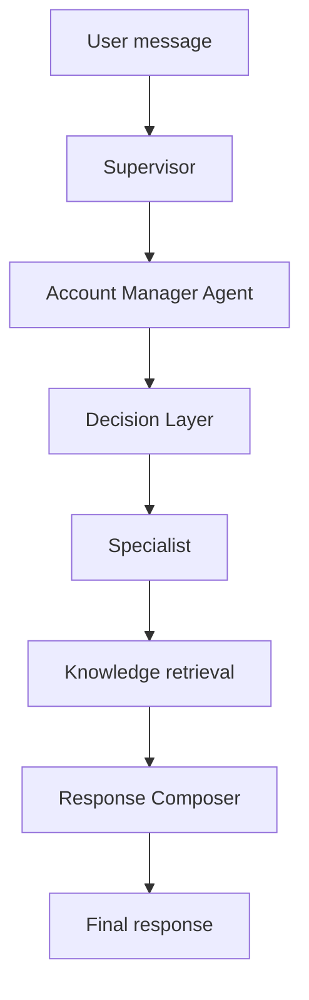
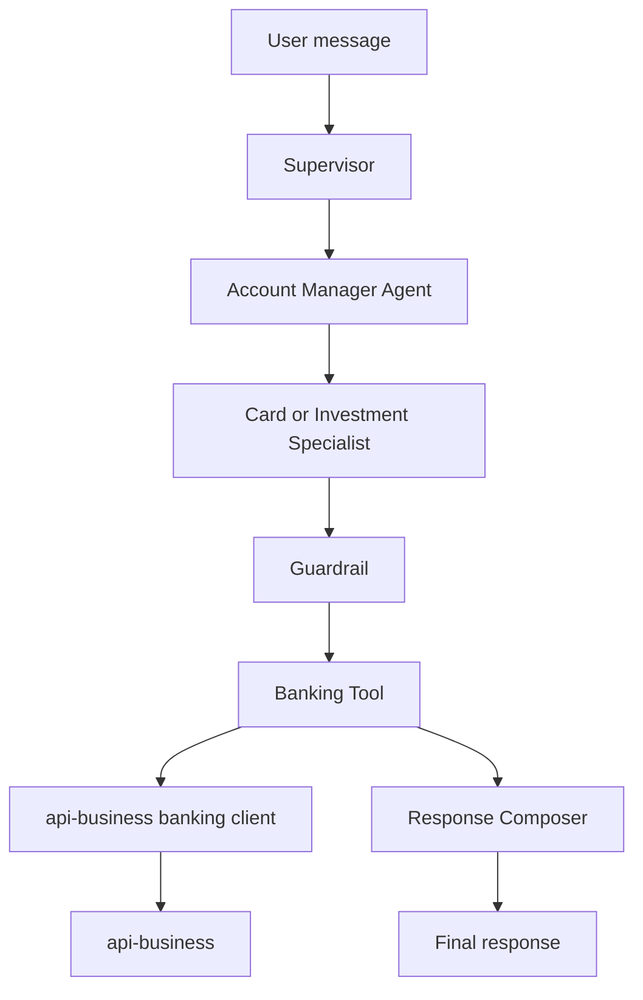
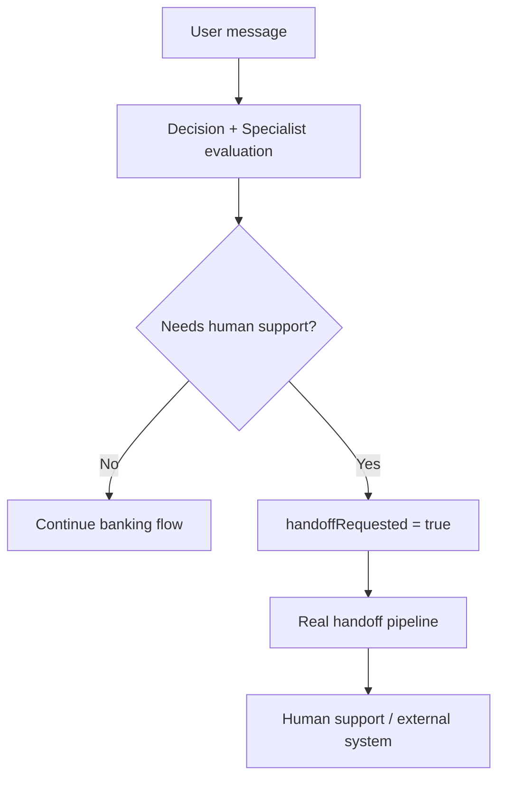
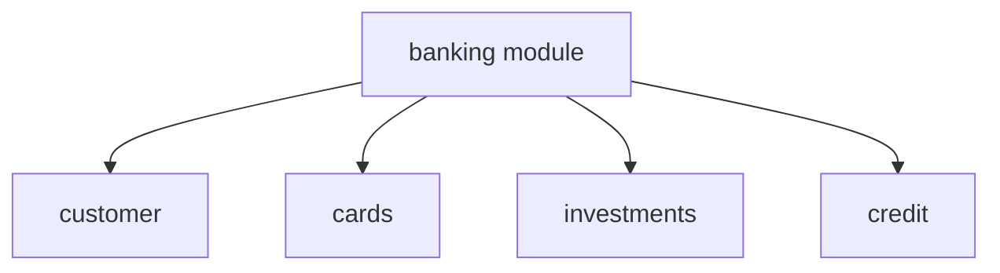

# Banking Architecture

This document describes the current banking scenario implemented in the repository.

The goal is to provide a virtual Account Manager that can answer banking questions, route to specialists, execute controlled actions, and escalate to humans when required.

## Objective

The banking scenario extends the Intelligent Automation Platform with a business-oriented runtime:

- the user sends a message
- the orchestrator classifies intent
- the account manager routes to a specialist
- the specialist chooses between knowledge retrieval, tools, or both
- guardrails protect sensitive actions
- the final answer is composed and returned

## Current Roles

### Account Manager Orchestrator

The account manager branch inside `apps/orchestrator` is responsible for:

- receiving banking conversations from the supervisor path
- classifying intent through the decision layer
- selecting the specialist strategy
- coordinating knowledge retrieval, tools, guardrails, response composition, and handoff

### Specialists

Current specialists include:

- `FaqSpecialist`
- `AccountSpecialist`
- `CardSpecialist`
- `CreditSpecialist`
- `InvestmentSpecialist`
- `DebtSpecialist`

Their job is to make contextual decisions, not to execute APIs directly.

### Decision Layer

The decision layer classifies the message into banking intents and suggests execution strategy. It is intentionally separate from tools and specialists so routing logic stays explicit and evolvable.

### Guardrails

Guardrails enforce:

- confirmation for sensitive operations
- minimum context checks
- protection against unsafe execution without enough information

Guardrails do not execute tools.

### Handoff

When the flow needs human support, the banking branch sets `handoffRequested` and reuses the real handoff pipeline already present in the orchestrator.

### Multi-Turn Confirmation

Sensitive operations, especially card blocking, preserve pending confirmation state. Because of that, short follow-up messages such as `confirmo`, `sim`, `yes`, or `pode seguir` remain in the banking branch instead of falling back to generic conversation.

## High-Level Banking Architecture

## Phase 1 Conversational Flow

Phase 1 established:

- banking routing through the supervisor
- account manager orchestration
- decision layer
- specialists
- response composer
- handoff reuse
- multi-turn confirmation for sensitive card flows

## Phase 2 Tool Flow

Phase 2 connected tools to real `api-business` endpoints instead of keeping them as purely local mocks.

## Handoff Flow

## `api-business` Banking Domains

## Current Tool Integration

Integrated with real `api-business` endpoints today:

- `BlockCardTool`
  - `POST /banking/cards/:id/block`
- `GetCardInfoTool`
  - `GET /banking/cards/:id`
  - `GET /banking/cards/:id/limit`
  - `GET /banking/cards/:id/invoice`
- `SimulateInvestmentTool`
  - `POST /banking/investments/simulate`
- `GetCustomerProfileTool`
  - `GET /banking/customer/profile`
- `GetCustomerSummaryTool`
  - `GET /banking/customer/summary`
- `SimulateCreditTool`
  - `POST /banking/credit/simulate`
- `GetCreditLimitTool`
  - `GET /banking/credit/limit`

## Implemented vs Partial

### Implemented

- banking account manager branch in the orchestrator
- decision layer with multilingual banking routing support
- specialists and response composer
- multi-turn confirmation for sensitive operations
- real handoff pipeline reuse
- contextual masking strategy
- correct observability for tool-only flows
- `api-business` banking domain with cards, investments, customer, and credit
- tool integration from orchestrator to `api-business`

### Still Mocked or Partial

- `api-business` banking services currently return mock-backed, stable domain data
- some flows still rely on default entity selection when the message does not specify a concrete resource
- not every specialist uses every banking endpoint yet
- debt negotiation remains a future domain for real business integration

## Architectural Rules

The current banking implementation follows these rules:

- `Knowledge retrieval` serves knowledge
- `Tool` serves action or deterministic business query
- `Specialist` decides
- `Guardrail` protects
- `Orchestrator` coordinates
- `api-business` owns business contracts

## Next Steps

Logical next steps after the current implementation:

- replace mock-backed banking services with repository and integration-backed implementations
- expand explicit entity resolution for cards and other products
- connect more banking specialists to real business endpoints
- deepen debt negotiation and other future banking domains
