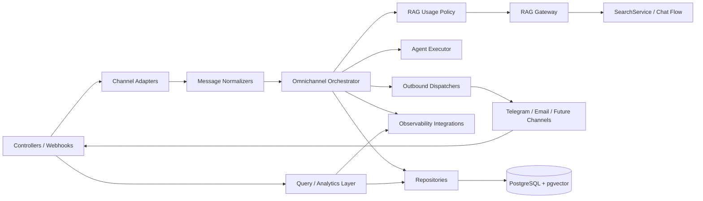

# Component Diagram

This view focuses on the main internal components of the backend in `apps/api`, especially the omnichannel and RAG orchestration path.

The goal is to show how the platform keeps transport concerns, orchestration logic, retrieval logic, persistence, analytics, and observability separated while still working as one cohesive backend.

## Component Diagram

## Components

### Controllers / Webhooks

The HTTP entry points for both standard API requests and channel-specific webhooks.

They remain thin and are responsible for:

- accepting transport requests
- validating DTOs
- delegating execution to services

They do not own orchestration logic.

### Channel Adapters

Adapters translate raw transport-specific payloads into the internal structures expected by the application.

They isolate channel-specific concerns such as Telegram update format or email-shaped inbound payloads.

### Message Normalizers

Normalizers convert channel-specific input into a shared internal message contract used by the omnichannel core.

This is the key boundary that keeps the orchestration flow channel-agnostic.

### Omnichannel Orchestrator

The central command-side service for omnichannel execution.

It is responsible for:

- persisting inbound messages
- opening execution context and telemetry
- deciding whether RAG should be used
- coordinating agent execution
- persisting execution and outbound messages
- delegating outbound transport to dispatchers

### RAG Usage Policy

A focused policy component that decides whether retrieval should be invoked for a given normalized message.

This keeps RAG invocation explicit and configurable instead of hardcoding retrieval into every request path.

### RAG Gateway

An adapter that reuses the existing RAG stack rather than duplicating retrieval behavior.

It bridges omnichannel execution with the platform's validated search and chat capabilities.

### Agent Executor

The component responsible for producing the response payload after policy evaluation and optional retrieval.

It works with the RAG gateway when contextual retrieval is needed and remains extensible for future multi-agent evolution.

### Repositories

Repositories isolate persistence from orchestration and query logic.

They provide access to:

- omnichannel messages
- executions
- connectors
- snapshots
- and other domain-specific records

They keep SQL and database access out of controllers and high-level services.

### Query / Analytics Layer

The read-optimized side of the omnichannel module.

It powers:

- overview metrics
- paginated request lists
- request details
- execution lists
- connector status
- RAG usage and latency analytics

This layer is intentionally separated from command-side orchestration, following a lightweight CQRS approach.

### Outbound Dispatchers

Dispatchers send responses back through the appropriate transport after the orchestrator has built the outbound message.

This preserves separation between response generation and channel delivery mechanics.

### Observability Integrations

Cross-cutting integrations for:

- Prometheus metrics
- structured logs
- OpenTelemetry spans
- correlation metadata

These integrations are invoked throughout both the command side and query side of the backend.

## Backend Boundary Note

Although this diagram highlights omnichannel-centric components, they operate within a broader backend that also includes:

- authentication and sessions
- document ingestion
- RAG retrieval and chat
- dashboard and observability endpoints
- health and operational endpoints

The backend architecture remains modular, with omnichannel extending the platform instead of replacing its existing RAG and chat foundations.
