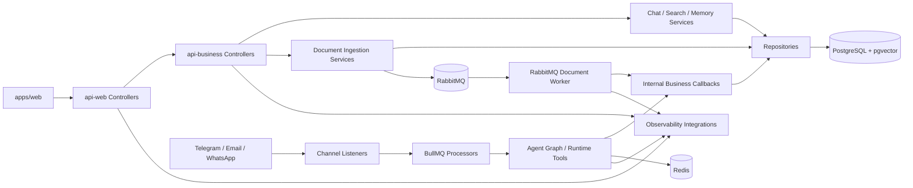

# Component Diagram

This view focuses on the main platform components across `apps/api-web`, `apps/api-business`, and `apps/orchestrator`.

The goal is to show how the platform keeps presentation concerns, synchronous business logic, asynchronous runtime work, persistence, and observability separated while still working as one cohesive platform.

## Component Diagram

## Components

### api-web Controllers

The presentation-facing HTTP entry points used by the portal.

They remain thin and are responsible for:

- accepting UI-driven requests
- delegating to the business boundary
- preserving the web-facing contract

They do not own business or runtime logic.

### api-business Controllers and Services

The synchronous business boundary owns chat, search, memory, documents, and ingestion status.

This layer persists state, applies domain rules, publishes document ingestion events, and exposes status for the portal.

### Repositories

Repositories isolate database access for documents, chat state, conversations, memory, analytics, and ingestion status.

### Channel Listeners and BullMQ Runtime

This runtime layer normalizes channel-origin input, enqueues work, and coordinates the main async orchestration path without moving domain persistence into the runtime.

### Agent Graph and Runtime Tools

These components own execution planning, tool usage, outbound routing, and async channel response behavior.

### RabbitMQ Document Worker

The document worker consumes `document.ingestion.requested`, runs heavy parsing, chunking, and embedding work, and updates business-side persisted status through internal callbacks.

### Observability Integrations

Cross-cutting integrations for:

- Prometheus metrics
- structured logs
- OpenTelemetry spans
- correlation metadata

These integrations are invoked across presentation, business, and runtime layers.

## Backend Boundary Note

The platform now uses explicit application boundaries rather than a single backend container. `api-web` stays presentation-focused, `api-business` stays synchronous and domain-focused, and `orchestrator` remains the asynchronous runtime boundary.
