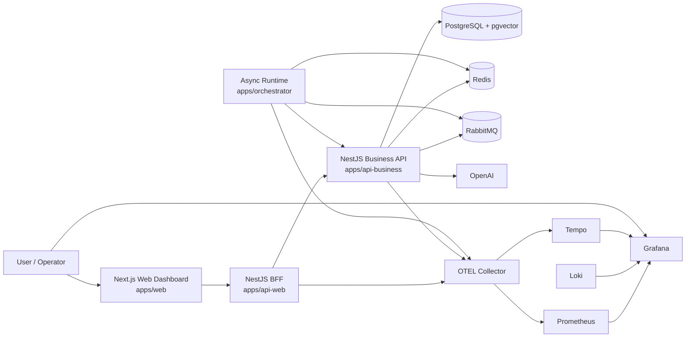

# Container Diagram

This view describes the main runtime containers and infrastructure services that make up RAG Platform.

The platform is implemented as a monorepo, but at runtime it is composed of a small set of clear containers and supporting services. The local Docker environment is intentionally observability-first so engineers can inspect metrics, logs, and traces during development and demos.

## Container Diagram

## Containers

### Next.js Web Dashboard

The operator-facing frontend in `apps/web`.

It provides:

- operational dashboards
- omnichannel request exploration
- connector monitoring
- chat and document workflows
- links into the observability stack

It consumes the backend API and presents the analytics/query layer in a usable interface.

### api-web

The portal-facing API in `apps/api-web`.

It provides:

- presentation-oriented endpoints for the web portal
- operational and dashboard proxy surfaces
- document upload and status proxy routes

### api-business

The synchronous business API in `apps/api-business`.

It is responsible for:

- chat and retrieval
- document ingestion requests and persisted status
- conversations and memory
- internal callbacks used by the orchestrator
- metrics, logs, and traces

### Orchestrator

The asynchronous runtime in `apps/orchestrator`.

It is responsible for:

- channel listeners and adapters
- BullMQ runtime queues and processors
- agent execution and routing
- RabbitMQ-backed document ingestion workers
- outbound channel dispatch

### PostgreSQL + pgvector

The primary database container.

It stores:

- relational application data
- document chunks
- vector embeddings
- conversations and messages
- omnichannel records
- analytics-supporting operational data

`pgvector` enables vector similarity search inside the same database used for transactional data.

### OpenAI

An external service, not hosted in the local stack.

It provides:

- embeddings generation
- LLM completion support for the current RAG flow

The API integrates with it through the AI abstraction layer already implemented in the backend.

## Observability Components

### Prometheus

Collects metrics exposed by the API and supporting observability services.

### Grafana

Visualizes dashboards for API health, omnichannel metrics, logs, and traces.

### Loki

Stores centralized logs, especially structured logs shipped from containerized services.

### Tempo

Provides distributed trace visualization for request flows such as channel handling, document ingestion, and RAG execution.

### OpenTelemetry Collector

Acts as the telemetry pipeline between the application and the observability backends, especially for traces and metrics export.

## Local Environment Note

The Docker-based local environment runs these containers together so the system can be explored end-to-end, including:

- application behavior
- operational dashboards
- metrics inspection
- log correlation
- trace analysis

PostgreSQL remains externally accessible on port `5433`.
