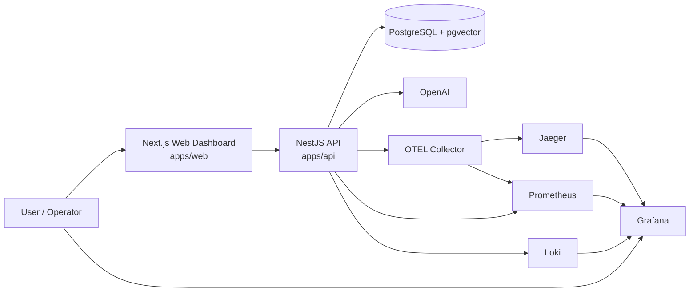

# Container Diagram

This view describes the main runtime containers and infrastructure services that make up RAG-PLATAFORM.

The platform is implemented as a monorepo, but at runtime it is composed of a small set of clear containers and supporting services. The local Docker environment is intentionally observability-first so engineers can inspect metrics, logs, and traces during development and demos.

## Container Diagram

## Containers

### Next.js Web Dashboard

The operator-facing frontend in `apps/web`.

It provides:

- operational dashboards
- omnichannel request exploration
- connector monitoring
- chat and document workflows
- links into the observability stack

It consumes the backend API and presents the analytics/query layer in a usable interface.

### NestJS API

The backend in `apps/api`.

It is responsible for:

- authentication and sessions
- document ingestion
- RAG retrieval and chat flows
- omnichannel inbound/outbound orchestration
- analytics and dashboard endpoints
- metrics, logs, and traces

This is the central application container in the runtime.

### PostgreSQL + pgvector

The primary database container.

It stores:

- relational application data
- document chunks
- vector embeddings
- conversations and messages
- omnichannel records
- analytics-supporting operational data

`pgvector` enables vector similarity search inside the same database used for transactional data.

### OpenAI

An external service, not hosted in the local stack.

It provides:

- embeddings generation
- LLM completion support for the current RAG flow

The API integrates with it through the AI abstraction layer already implemented in the backend.

## Observability Components

### Prometheus

Collects metrics exposed by the API and supporting observability services.

### Grafana

Visualizes dashboards for API health, omnichannel metrics, logs, and traces.

### Loki

Stores centralized logs, especially structured logs shipped from containerized services.

### Jaeger

Provides distributed trace visualization for request flows such as omnichannel orchestration and RAG execution.

### OpenTelemetry Collector

Acts as the telemetry pipeline between the application and the observability backends, especially for traces and metrics export.

## Local Environment Note

The Docker-based local environment runs these containers together so the system can be explored end-to-end, including:

- application behavior
- operational dashboards
- metrics inspection
- log correlation
- trace analysis

PostgreSQL remains externally accessible on port `5433`.
