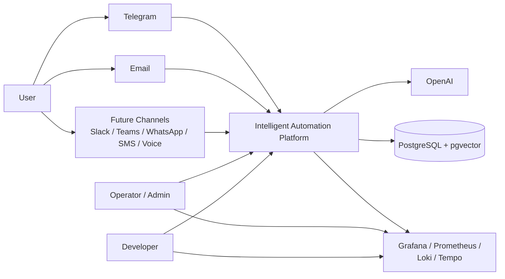

# System Context

Intelligent Automation Platform is the central automation and orchestration platform in this ecosystem.

Its role is to receive requests from multiple channels, normalize them into a channel-agnostic internal contract, orchestrate execution through agent-based flows and optional knowledge retrieval, persist operational data, and expose dashboards and observability signals for operators and developers.

## System Context Diagram

## Actors

### User

A person interacting with the platform through supported channels such as Telegram or Email. The user is primarily interested in receiving useful answers, not in the internal architecture of the system.

### Operator / Admin

A platform operator who uses the web dashboard and observability tooling to inspect requests, connector status, latency, knowledge retrieval usage, and operational health.

### Developer

An engineer working on the monorepo, API, dashboard, omnichannel flows, or infrastructure. Developers rely on the documentation, telemetry, and local Docker stack to evolve the platform safely.

## External Systems

### Telegram

A real inbound and outbound integration channel used through webhook-based updates and Bot API dispatch.

### Email

A development-mode inbound and outbound provider used to exercise the omnichannel pipeline with an email-shaped contract.

### Future Channels

Additional connectors planned in the architecture, including Slack, Microsoft Teams, WhatsApp, SMS, and Voice. They are represented as future extension points rather than fully implemented integrations.

### OpenAI

The external AI provider used for embeddings and LLM completions in the current knowledge retrieval and automation implementation.

### PostgreSQL + pgvector

The primary persistence platform used for transactional data, conversations, omnichannel records, and vector search.

### Grafana / Prometheus / Loki / Tempo

The observability toolchain used to inspect metrics, logs, and traces emitted by the platform.

## System of Interest

### Intelligent Automation Platform

The main platform that combines:

- omnichannel message processing
- channel normalization and orchestration
- optional knowledge retrieval invocation
- persistence and analytics
- dashboard-facing query endpoints
- observability-first runtime behavior
