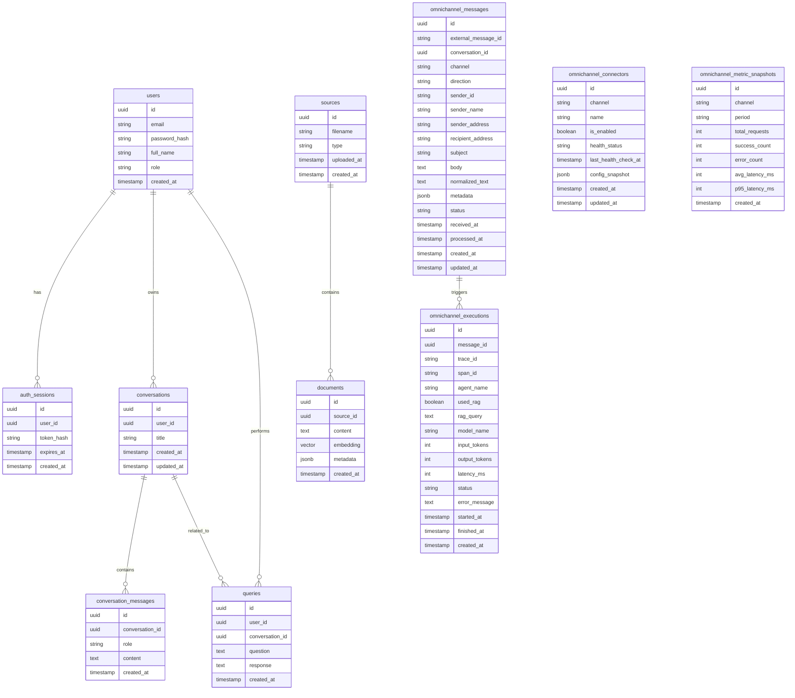

# Database ERD

This diagram shows the logical relationships between the main database tables used by **Intelligent Automation Platform**.

The schema supports:

- user authentication
- document ingestion
- knowledge retrieval
- chat conversations
- omnichannel messaging
- execution tracking

---

`used_rag` and `rag_query` remain current field names for compatibility, even though the platform is now positioned more broadly than a retrieval-centric product.
