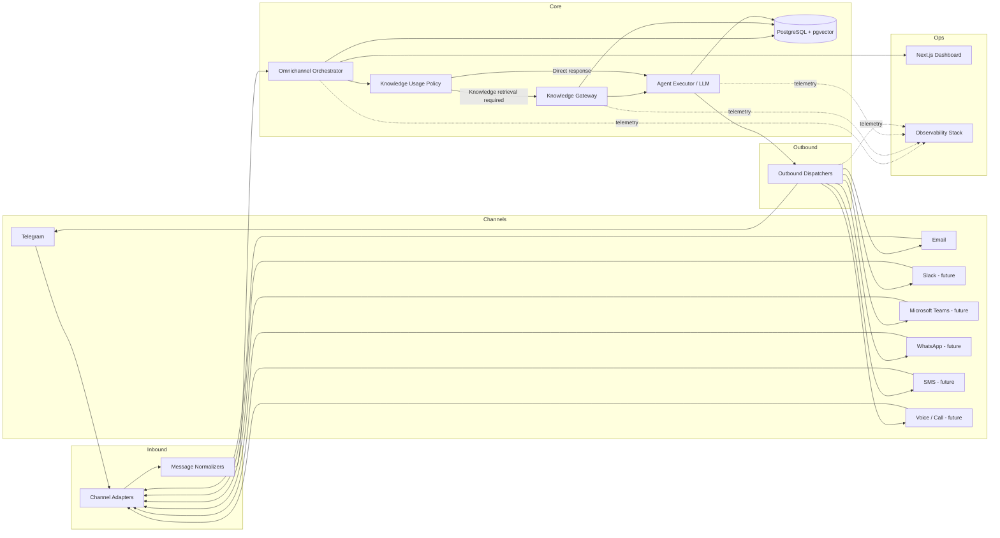

# MCP / Omnichannel Architecture

This diagram shows how **Intelligent Automation Platform** handles multi-channel communication through an MCP-style omnichannel architecture.

The platform receives requests from different channels, normalizes them into a common contract, routes them through orchestration and optional knowledge retrieval, and dispatches the response back to the originating channel.

---

---

# Architecture Overview

The MCP / Omnichannel layer acts as the communication boundary of the platform.

Its job is to ensure that all channels can use the same internal orchestration engine without duplicating business logic.

This keeps the platform:

- modular
- extensible
- channel-agnostic
- easier to observe and maintain

---

# Channel Layer

The system supports current and future communication channels.

Current channels:

- Telegram
- Email

Planned channels:

- Slack
- Microsoft Teams
- WhatsApp
- SMS
- Voice / Call

Each channel is integrated through dedicated infrastructure components.

---

# Inbound Layer

## Channel Adapters

Adapters receive raw payloads from each channel.

Examples:

- Telegram webhook payload
- inbound email payload
- future Slack or Teams events

Adapters isolate transport-specific details from the core system.

---

## Message Normalizers

Normalizers convert raw payloads into a common internal contract.

Typical normalized fields include:

- channel
- sender metadata
- conversation identifier
- external message id
- message body
- subject
- metadata

This allows the orchestration layer to remain independent from channel-specific formats.

---

# Core Orchestration Layer

## Omnichannel Orchestrator

The orchestrator is the central coordination service.

Responsibilities include:

- persisting inbound messages
- building execution context
- applying routing and orchestration rules
- deciding whether knowledge retrieval is needed
- calling the agent execution layer
- persisting execution results
- triggering outbound dispatch

This is the heart of the MCP architecture.

---

## Knowledge Usage Policy

The policy layer decides whether contextual retrieval should be used.

Possible strategies include:

- keyword-based triggers
- message intent classification
- connector-specific rules
- future policy engines

This avoids forcing every request through the retrieval pipeline.

---

## Knowledge Gateway

The Knowledge Gateway provides access to contextual retrieval without coupling the omnichannel module to the internal implementation of the retrieval engine.

It can reuse:

- vector search
- SQL filtering
- context assembly
- retrieval ranking strategies

---

## Agent Executor / LLM

The agent execution layer receives either:

- direct user input
- or input enriched with retrieved context

It produces the final response and records execution metadata such as:

- model name
- token usage
- latency
- status
- error details

---

## Persistence Layer

Operational data is stored in PostgreSQL + pgvector.

Examples include:

- omnichannel messages
- execution metadata
- conversations
- documents
- embeddings
- connector health
- metric snapshots

This supports:

- observability
- auditing
- analytics
- dashboard queries

---

# Outbound Layer

## Outbound Dispatchers

Dispatchers return responses through the proper originating channel.

Examples:

- Telegram outbound dispatcher
- Email outbound dispatcher
- future Slack dispatcher
- future Teams dispatcher

This keeps response delivery channel-specific, while preserving a shared orchestration model.

---

# Operations Layer

## Dashboard

The Next.js dashboard provides operational visibility.

It can display:

- total requests
- channel distribution
- request details
- latency metrics
- knowledge retrieval usage
- connector health

---

## Observability Stack

Telemetry is emitted throughout the lifecycle.

The observability stack includes:

- Prometheus
- Grafana
- Loki
- Tempo
- OpenTelemetry Collector

This enables:

- metrics monitoring
- structured logs
- distributed tracing
- connector troubleshooting

---

# Why This Architecture Matters

This design makes the platform suitable for real-world AI communication workflows.

Benefits include:

- channels can be added incrementally
- orchestration logic remains centralized
- knowledge retrieval stays reusable
- business logic remains independent from transport layers
- observability is built into the system from the beginning
