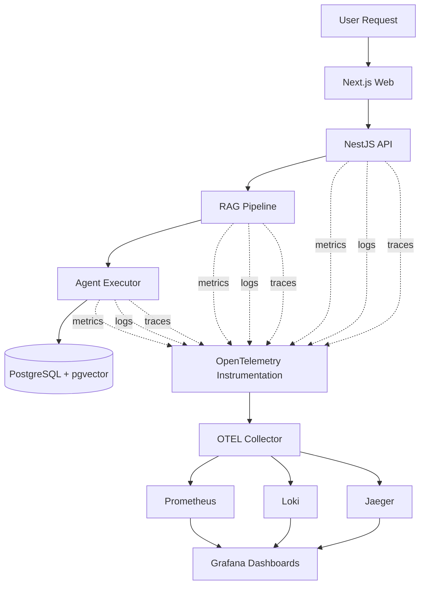

# Observability Flow

This diagram shows how telemetry flows through the **RAG-PLATAFORM observability stack**.

The platform follows an **observability-first architecture**, capturing:

- metrics
- logs
- distributed traces

These signals allow operators to monitor system health and diagnose failures.

---

---

# Telemetry Types

The platform emits three main types of telemetry signals.

## Metrics

Metrics track numerical measurements over time.

Examples:

- request count
- request latency
- RAG execution duration
- vector search time
- LLM response latency

Metrics are collected by **Prometheus** and visualized in **Grafana**.

---

## Logs

Logs capture structured runtime events.

Examples include:

- inbound message logs
- RAG retrieval logs
- agent execution logs
- dispatch failures

Logs are aggregated using:

- **Promtail**
- **Loki**

---

## Distributed Traces

Tracing shows the lifecycle of a request across services.

Example trace flow:

1. request received
2. normalization
3. orchestration
4. optional RAG retrieval
5. agent execution
6. response dispatch

Traces are collected through:

- OpenTelemetry instrumentation
- Jaeger tracing backend

---

# Grafana Dashboards

Grafana provides a unified view of the system.

Typical dashboards include:

### API Metrics

- request throughput
- error rate
- latency percentiles

### RAG Performance

- embedding duration
- vector search latency
- LLM response time

### Omnichannel Activity

- requests per channel
- response latency
- connector health

### Infrastructure

- container health
- database connections
- resource usage

---

# Observability Benefits

This architecture allows engineers to:

- detect failures quickly
- analyze AI pipeline performance
- monitor channel activity
- debug distributed workflows
- understand RAG execution behavior
