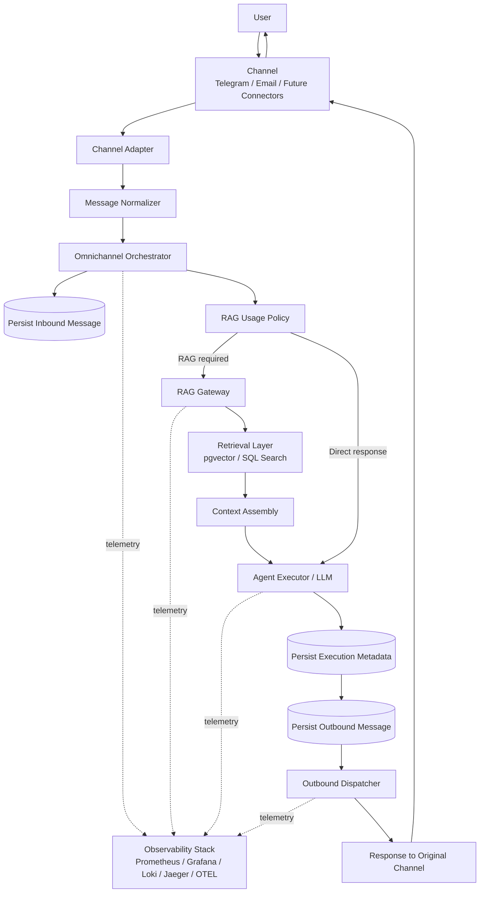

# Omnichannel + RAG Flow

This diagram shows the end-to-end execution flow of **RAG-PLATAFORM**, from inbound channel message to outbound response, including orchestration, optional RAG retrieval, persistence, and observability.

---

---

# Flow Explanation

## 1. Message Ingestion

A user sends a message through a supported channel such as:

- Telegram
- Email
- future connectors like Slack, Teams, WhatsApp, SMS, or Voice

The raw payload is received by a channel-specific adapter.

---

## 2. Normalization

The adapter passes the payload to a message normalizer.

The normalizer converts channel-specific fields into a common internal contract, including:

- channel
- sender metadata
- conversation identifier
- subject and body
- normalized text
- message metadata

This ensures the orchestration layer remains channel-agnostic.

---

## 3. Orchestration

The normalized message is passed to the **Omnichannel Orchestrator**.

The orchestrator is responsible for:

- persisting the inbound message
- creating execution context
- applying routing and orchestration logic
- deciding whether RAG is needed
- calling the agent execution layer
- persisting results
- triggering outbound dispatch

---

## 4. RAG Decision

The **RAG Usage Policy** decides whether contextual retrieval is required.

Possible strategies include:

- keyword-based RAG activation
- explicit retrieval requests
- connector-specific policies
- future agent-driven routing decisions

If retrieval is needed, the orchestrator calls the RAG Gateway.

---

## 5. Retrieval

The **RAG Gateway** reuses the existing retrieval engine instead of duplicating it.

The retrieval layer performs:

- vector similarity search
- SQL-based filtering
- context assembly

Context is then sent to the agent execution layer.

---

## 6. Agent Execution

The **Agent Executor / LLM** receives either:

- direct user input
- or user input enriched with retrieved context

The agent generates the final response.

Execution metadata may include:

- model name
- token usage
- latency
- RAG usage flag
- execution status

---

## 7. Persistence

The platform persists multiple stages of execution.

### Inbound message

Stored before orchestration starts.

### Execution metadata

Stored after orchestration and agent execution.

### Outbound message

Stored before the response is dispatched back to the channel.

This enables:

- auditability
- observability
- analytics
- replay/debugging support

---

## 8. Outbound Dispatch

The outbound dispatcher sends the response through the correct channel.

Examples:

- Telegram dispatcher
- Email dispatcher
- future Slack / Teams / WhatsApp dispatchers

The user receives the response through the same channel that originated the request.

---

## 9. Observability

Telemetry is emitted throughout the execution lifecycle.

The observability stack captures:

- metrics in Prometheus
- dashboards in Grafana
- logs in Loki
- traces in Jaeger
- telemetry routing through OpenTelemetry Collector

This supports:

- latency analysis
- failure debugging
- request tracing
- connector monitoring
