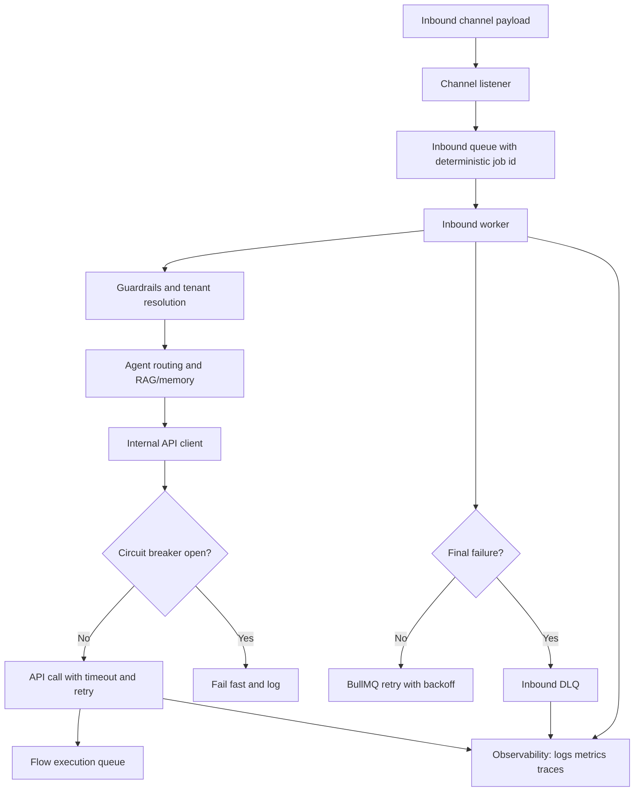

# Resilient Runtime Flow

```mermaid
flowchart TD
  A[Inbound channel payload] --> B[Channel listener]
  B --> C[Inbound queue with deterministic job id]
  C --> D[Inbound worker]
  D --> E[Guardrails and tenant resolution]
  E --> F[Agent routing and RAG/memory]
  F --> G[Internal API client]
  G --> H{Circuit breaker open?}
  H -- No --> I[API call with timeout and retry]
  H -- Yes --> J[Fail fast and log]
  I --> K[Flow execution queue]
  D --> L{Final failure?}
  L -- No --> M[BullMQ retry with backoff]
  L -- Yes --> N[Inbound DLQ]
  I --> O[Observability: logs metrics traces]
  D --> O
  N --> O
```
