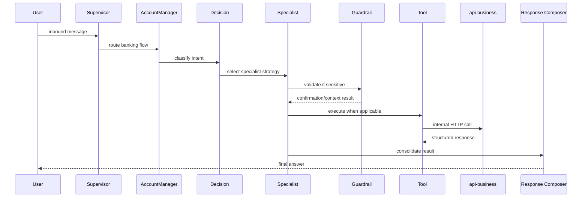

# Runtime Flow

This document summarizes how runtime execution works today, with emphasis on the banking scenario.

## Core Principle

Channels transport events. The orchestrator controls execution.

- channels receive user messages and provider callbacks
- adapters normalize a canonical payload
- the `inbound-messages` queue hands work to the orchestrator
- the `supervisor-agent` routes the flow
- the banking branch uses the account manager orchestration when applicable
- specialists decide whether to use RAG, tools, handoff, or a combination
- the `flow-execution` queue completes downstream work
- outbound adapters return the final response to the origin channel

## Runtime Rules

- channels do not perform business routing
- channels do not execute tools directly
- `RAG` is used for knowledge retrieval, not business execution
- `Tools` execute deterministic queries and actions
- `Guardrails` validate sensitive operations before tool execution
- `Handoff` uses the real handoff pipeline when required
- `api-business` stays the synchronous business boundary

## Banking Flow

## Phase 1 Runtime Characteristics

Phase 1 established the banking orchestration shell:

- supervisor routing into the banking branch
- decision layer
- specialists
- response composer
- real handoff reuse
- multi-turn pending confirmation for sensitive operations

## Phase 2 Runtime Characteristics

Phase 2 connected tool execution to the real `api-business` banking contracts:

- card block and card info tools
- investment simulation tool
- customer profile and summary tools
- credit simulation and credit limit tools

The specialists still decide when to use these tools. The tools themselves do not decide business flow.

## Multi-Turn Confirmation

Sensitive banking flows preserve pending confirmation state. This allows short follow-up messages such as `confirmo`, `sim`, or `yes` to stay inside the banking branch without depending on another banking keyword.

## Handoff

When a banking flow requires human support:

- the specialist or orchestrator marks `handoffRequested`
- the banking branch reuses the existing handoff pipeline
- the flow does not simulate handoff with a plain text response

## Tool-Only vs RAG Flows

- tool-only flows do not generate artificial LLM context
- tool-only flows should not emit LLM token or cost telemetry
- knowledge-assisted flows continue to emit retrieval and AI-related observability data
