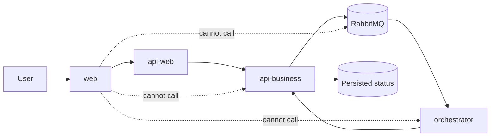

# How Security Works

This is the simple version of the platform security model.

## What users can access

Users interact with the system through:

- `web`
- `api-web`

That is the public edge of the platform.

When a user signs in, `api-web` validates who they are and what they are allowed to do. The frontend does not call `api-business`, `orchestrator`, or RabbitMQ directly.

## What happens behind the scenes

After `api-web` accepts a user request, it talks to internal services using a different kind of token made for services, not people.

- user token
  - proves who the user is
- internal service token
  - proves which backend service is calling another backend service

This separation is important because an internal backend should not trust a request only because it came from inside the network.

## How document processing is protected

Document ingestion uses a protected internal path:

1. the user sends a request through `web`
2. `api-web` validates the user token
3. `api-web` calls `api-business` with an internal service token
4. `api-business` publishes work to RabbitMQ using broker credentials
5. `orchestrator` consumes the message using broker credentials
6. `orchestrator` calls `api-business` back with its own internal service token
7. the final status is stored and later shown to the user

## Why RabbitMQ does not use user login tokens

RabbitMQ is infrastructure, not a user-facing API.

So the queue uses:

- broker username/password
- internal network boundaries
- broker permissions

It does not use browser tokens or end-user JWTs.

## Public vs internal services

Public:

- `web`
- `api-web`

Internal:

- `api-business`
- `orchestrator`
- `rabbitmq`
- database and other runtime infrastructure

## What this protects us from

This model helps prevent:

- direct browser access to internal services
- accidental trust of all internal traffic
- misuse of user tokens for infrastructure access
- uncontrolled access between backend services

## Where to read the technical version

For the engineering view, token claims, folder layout, and boundary diagrams, see:

- [Security Architecture](../architecture/security-architecture.md)
