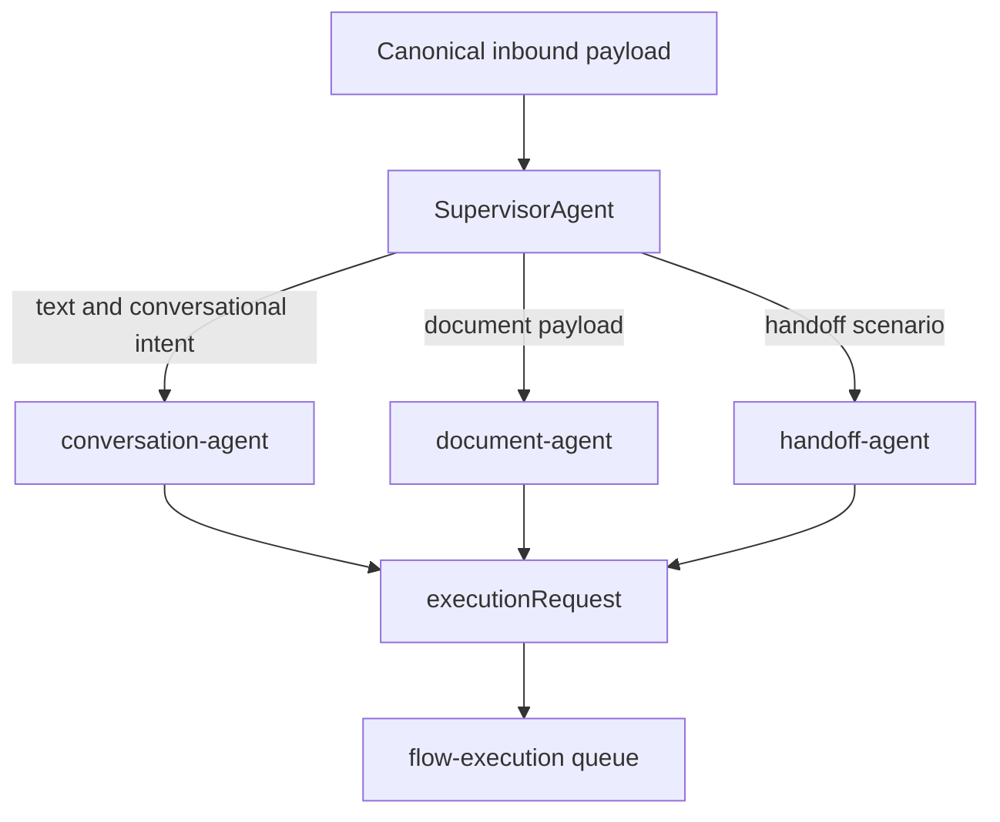

# Agent Architecture

[Home](Home) | [Runtime Flow](Runtime-Flow) | [Document Processing](Document-Processing)

`AgentGraphService` turns a canonical inbound message into a downstream execution request.

## Current Execution Model

1. the inbound processor sends the canonical payload to the graph
2. the supervisor selects the target agent
3. the selected agent plans the action and context
4. the graph returns an `executionRequest`
5. the runtime enqueues `flow-execution`

Current specialized agents:

- `SupervisorAgent`
- `conversation-agent`
- `document-agent`
- `handoff-agent`

## Current Architectural Note

The graph is explicit and readable, but the surrounding runtime still concentrates a large amount of operational work in `InboundMessageProcessor`.

Source:

- [docs/ARCHITECTURE.md](../ARCHITECTURE.md)
- [docs/ARCHITECTURE_DECISIONS.md](../ARCHITECTURE_DECISIONS.md)
