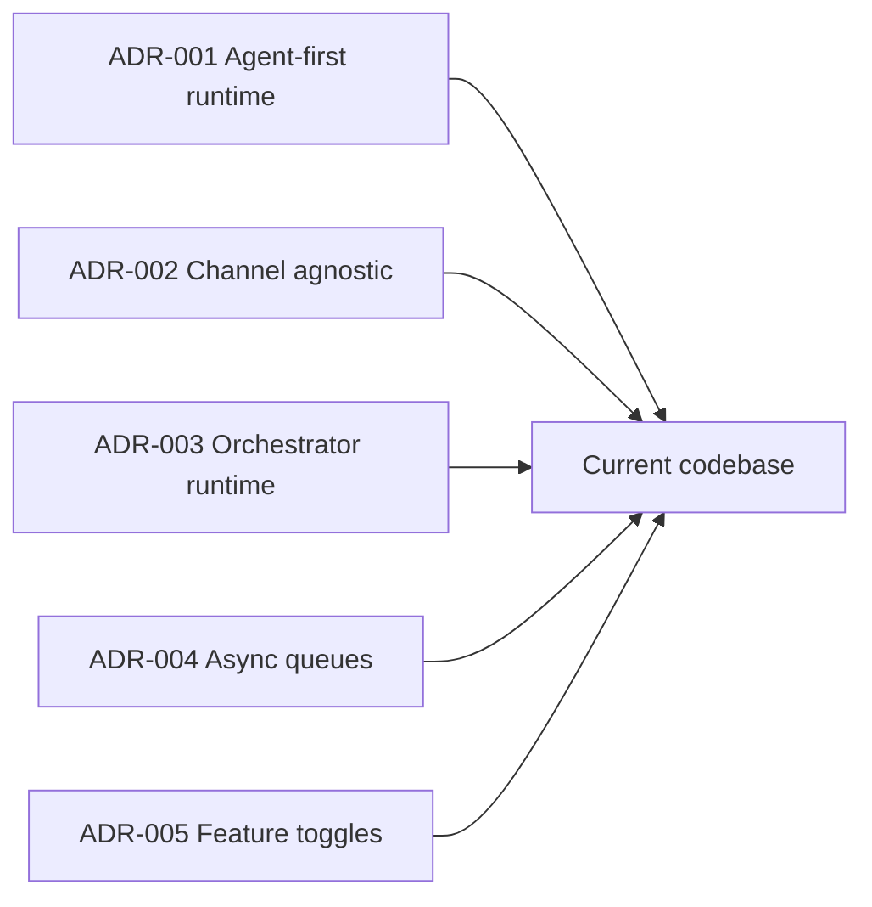

# Architecture Decisions

[Home](Home) | [Architecture Overview](Architecture-Overview) | [System Architecture](System-Architecture)

This page summarizes how the current codebase aligns with the main architecture decisions.

## Decision Summary

## Current Validation

- ADR-001 agent-first runtime: aligned
- ADR-002 channel agnostic: aligned
- ADR-003 orchestrator runtime: aligned
- ADR-004 async queues: aligned
- ADR-005 feature toggles: aligned

## Current Architectural Attention Points

- `InboundMessageProcessor` still concentrates a large amount of runtime responsibility
- end-to-end idempotency is still not centralized
- document lifecycle and vector persistence are still evolving for larger-scale production scenarios

Source:

- [docs/ARCHITECTURE_DECISIONS.md](/home/cicero/projects/rag-platform/docs/ARCHITECTURE_DECISIONS.md)
