# Architecture Overview

[Home](Home) | [System Architecture](System-Architecture) | [Architecture Decisions](Architecture-Decisions)

The platform implements AI agent orchestration in a TypeScript monorepo. External channel events are normalized into canonical contracts, processed by a central asynchronous runtime, and routed through agents that decide whether the system should answer, ingest a document, retrieve context, or hand off execution.

Core principles reflected by the codebase:

- `agent-first`
- `channel-agnostic`
- `orchestrator-centered`
- `event-driven`

```mermaid
flowchart LR
    Channels[Channels] --> Adapters[Channel Adapters]
    Adapters --> InboundQ[inbound-messages]
    InboundQ --> InboundProcessor[InboundMessageProcessor]
    InboundProcessor --> Graph[AgentGraphService]
    Graph --> FlowQ[flow-execution]
    FlowQ --> FlowProcessor[FlowExecutionProcessor]
    FlowProcessor --> Outbound[Outbound Services]
```

## Responsibilities by Layer

- Channels receive external events.
- Adapters normalize provider payloads into canonical messages.
- The inbound queue decouples intake from runtime execution.
- The orchestrator resolves tenant context, runs guardrails, traces, and agent planning.
- The flow-execution queue materializes downstream actions.
- Outbound services deliver the result through the correct channel.

Source:

- [docs/ARCHITECTURE.md](/home/cicero/projects/rag-platform/docs/ARCHITECTURE.md)
