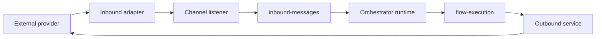
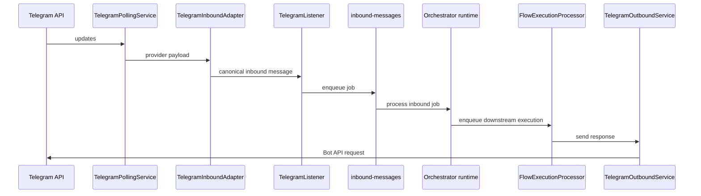

# Channel Integrations

[Home](Home) | [Runtime Flow](Runtime-Flow) | [Document Processing](Document-Processing)

Channels are treated as the transport layer.

They should:

- receive external events
- normalize payloads
- publish canonical messages to the inbound queue
- deliver outbound responses

They should not:

- choose the target agent
- perform document ingestion
- execute retrieval logic
- own runtime business rules

## Telegram

Telegram is the most mature channel in the repository.

Email and WhatsApp follow the same overall direction, but remain less mature operationally than Telegram.

Source:

- [docs/CHANNEL_INTEGRATION.md](../CHANNEL_INTEGRATION.md)
- [docs/channels/telegram.md](../channels/telegram.md)
