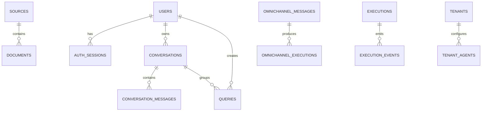
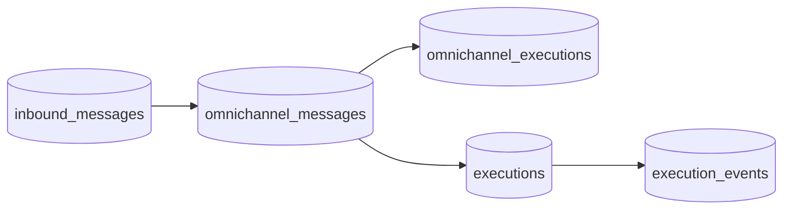

# Database Model

[Home](Home) | [Knowledge Retrieval Capability](RAG-Architecture) | [Architecture Overview](Architecture-Overview)

This page is derived strictly from the SQL migrations under `database/migrations/`.

## Scope

The migrations clearly define:

- knowledge source and chunk storage
- authentication and conversations
- omnichannel messaging and execution tracking
- inbound message journaling
- evaluation and feedback
- tenant and agent configuration
- usage metrics

## Verified ER Diagram

## Important Limitations

The migrations do not prove a complete foreign-key graph for every logical relationship in the application. For example:

- `documents.tenant_id` is indexed but not declared as a foreign key to `tenants`
- `ai_usage_metrics.tenant_id` is not declared as a foreign key
- `simulation_results.scenario_id` is not declared as a foreign key
- `conversation_memory.conversation_id` is stored as text, not as a foreign key

Source:

- [docs/DATABASE.md](../DATABASE.md)
- [database/migrations](../../database/migrations)
