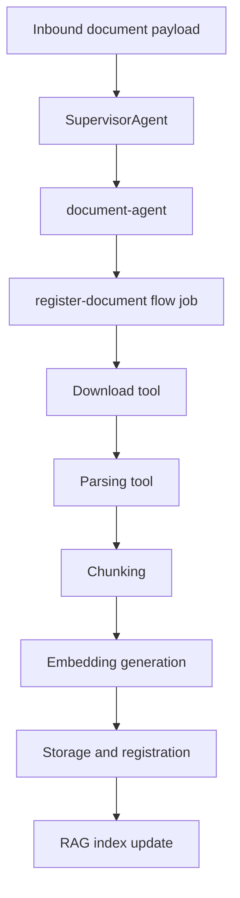

# Document Processing

[Home](Home) | [RAG Architecture](RAG-Architecture) | [Channel Integrations](Channel-Integrations)

Document ingestion is planned by `document-agent` and executed through reusable tools.

## Current Pipeline

The repository clearly implements:

- document-oriented planning through `document-agent`
- download and parsing tools
- chunking
- embedding generation
- storage and index registration

## Honest Scope Note

The code supports the core ingestion path, but the full enterprise-grade binary lifecycle and stronger reconciliation for partial failures are still evolving.

Source:

- [docs/ARCHITECTURE.md](/home/cicero/projects/rag-platform/docs/ARCHITECTURE.md)
- [docs/rag/document-ingestion.md](/home/cicero/projects/rag-platform/docs/rag/document-ingestion.md)
