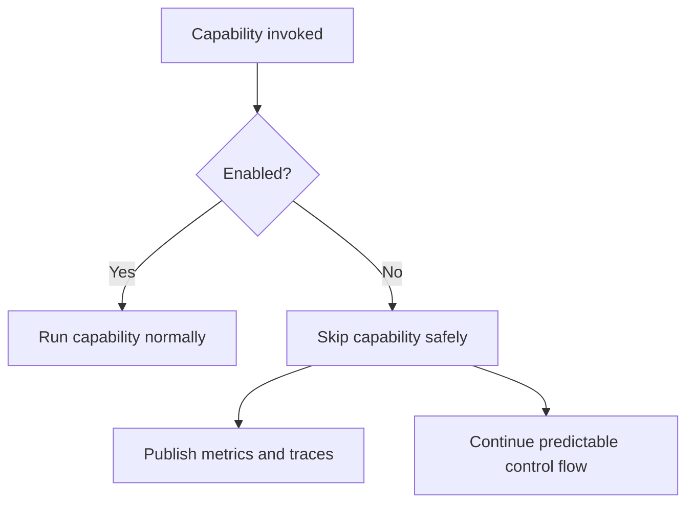

# Feature Toggles

[Home](Home) | [Queue Topology](Queue-Topology) | [Observability](Observability)

The current runtime supports explicit production-oriented toggles, including:

- `TELEGRAM_ENABLED`
- `DOCUMENT_INGESTION_ENABLED`
- `DOCUMENT_PARSING_ENABLED`
- `RAG_RETRIEVAL_ENABLED`
- `CONVERSATION_MEMORY_ENABLED`
- `EVALUATION_ENABLED`
- `OUTBOUND_SENDING_ENABLED`
- `TRAINING_PIPELINE_ENABLED`

## Safe Degradation

- disabled ingestion skips document side effects
- disabled parsing falls back safely
- disabled retrieval returns no retrieved documents
- disabled memory returns empty context
- disabled evaluation skips evaluation side effects
- disabled outbound sending logs and skips delivery

Source:

- [docs/ARCHITECTURE.md](/home/cicero/projects/rag-platform/docs/ARCHITECTURE.md)
- [docs/architecture/feature-flags.md](/home/cicero/projects/rag-platform/docs/architecture/feature-flags.md)
