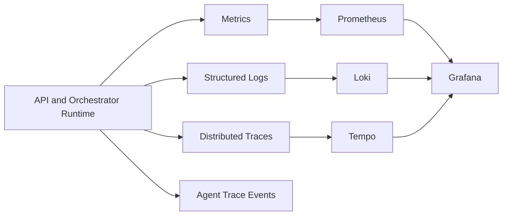

# Observability

[Home](Home) | [Runtime Flow](Runtime-Flow) | [Testing Strategy](Testing-Strategy)

The repository includes:

- structured logs
- Prometheus-style metrics
- OpenTelemetry tracing
- dedicated agent trace events
- queue-related failure and throughput metrics
- cost and evaluation analytics in the orchestrator path

## Stack

- OpenTelemetry
- Prometheus
- Grafana
- Tempo
- Loki

Source:

- [docs/ARCHITECTURE.md](../ARCHITECTURE.md)
- [docs/observability/OBSERVABILITY.md](../observability/OBSERVABILITY.md)
