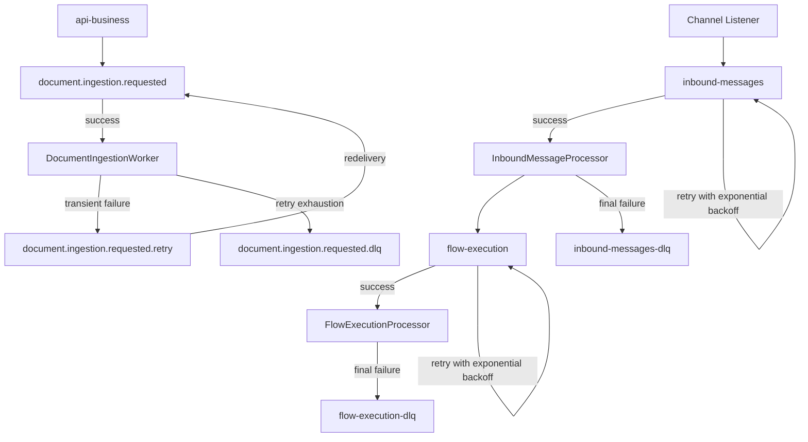

# Queue Topology

[Home](Home) | [Runtime Flow](Runtime-Flow) | [Feature Toggles](Feature-Toggles)

The platform currently uses two queue systems for different responsibilities.

BullMQ remains the main orchestrator runtime queue system:

- `inbound-messages`
- `flow-execution`

RabbitMQ is used only for asynchronous document ingestion:

- `document.ingestion.requested`
- `document.ingestion.requested.retry`
- `document.ingestion.requested.dlq`

## Queue Responsibilities

- `inbound-messages`
  - inbound entry point for canonical channel payloads
  - `jobId` derived from `channel:externalMessageId`
- `flow-execution`
  - downstream execution stage after agent planning
  - `jobId` derived from `jobName:channel:externalMessageId`
- `document.ingestion.requested`
  - asynchronous document ingestion queue published by `api-business`
  - consumed by the orchestrator document worker
- `document.ingestion.requested.retry`
  - bounded retry path for transient ingestion failures
- `document.ingestion.requested.dlq`
  - terminal failure inspection queue after retry exhaustion

## Retry and DLQ

- BullMQ queues use configurable attempts and backoff
- RabbitMQ document ingestion uses bounded retry attempts with retry metadata
- final terminal failures land in an explicit DLQ instead of being dropped silently

Source:

- [docs/ARCHITECTURE.md](../ARCHITECTURE.md)
