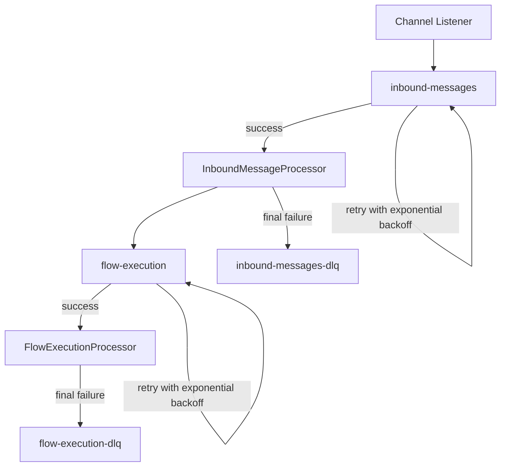

# Queue Topology

[Home](Home) | [Runtime Flow](Runtime-Flow) | [Feature Toggles](Feature-Toggles)

The orchestrator currently uses two BullMQ queues in the main runtime path:

- `inbound-messages`
- `flow-execution`

## Queue Responsibilities

- `inbound-messages`
  - inbound entry point for canonical channel payloads
  - `jobId` derived from `channel:externalMessageId`
- `flow-execution`
  - downstream execution stage after agent planning
  - `jobId` derived from `jobName:channel:externalMessageId`

## Retry and DLQ

- both queues use configurable attempts
- both queues use exponential backoff
- final failures are packaged into DLQ messages

Source:

- [docs/ARCHITECTURE.md](../ARCHITECTURE.md)
