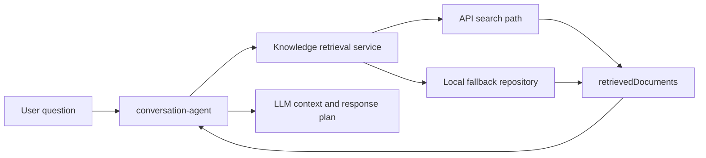

# Knowledge Retrieval Capability

[Home](Home) | [Document Processing](Document-Processing) | [Database Model](Database-Model)

The repository currently supports:

- chunked document storage in PostgreSQL with `pgvector`
- a `documents` table with `VECTOR(1536)` embeddings
- a `rag_documents` table used by orchestrator-side retrieval
- retrieval context assembly in the orchestrator
- safe fallback behavior when retrieval is disabled

## Current Reading

The vector persistence layer is functional, but still evolving for larger-scale production scenarios.

Source:

- [docs/ARCHITECTURE.md](../ARCHITECTURE.md)
- [docs/rag/rag-flow.md](../rag/rag-flow.md)
