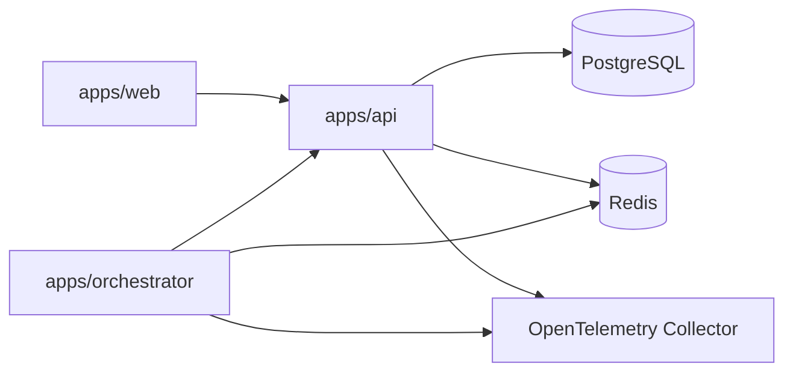

# Running Locally

[Home](Home) | [Testing Strategy](Testing-Strategy) | [Channel Integrations](Channel-Integrations)

## Local Topology

## Minimum Flow

1. install dependencies
2. start infrastructure with Docker Compose
3. start `api`, `orchestrator`, and `web`
4. validate health endpoints
5. run targeted tests or exercise the Telegram path

## Important Note

If Telegram is enabled without credentials, the orchestrator will fail fast during startup.

Source:

- [docs/RUNNING_LOCALLY.md](../RUNNING_LOCALLY.md)
