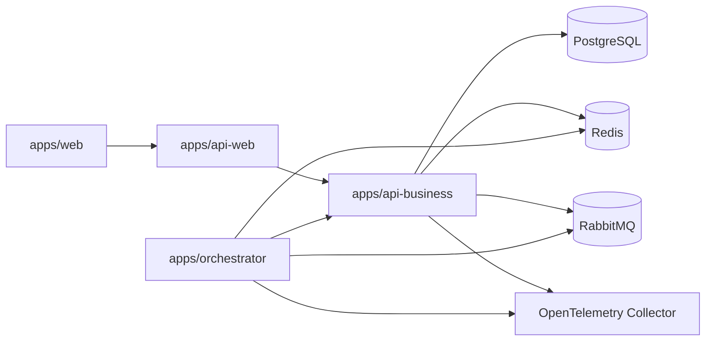

# Running Locally

[Home](Home) | [Testing Strategy](Testing-Strategy) | [Channel Integrations](Channel-Integrations)

## Local Topology

## Minimum Flow

1. install dependencies
2. start infrastructure with Docker Compose and keep Docker as the local standard for Postgres, Redis, RabbitMQ, and observability
3. start `api-web`, `api-business`, `orchestrator`, and `web` locally in debug mode
4. validate health endpoints
5. run targeted tests, exercise a chat flow, or submit a document and observe persisted status updates

## Important Note

If Telegram is enabled without credentials, the orchestrator will fail fast during startup.

Source:

- [docs/RUNNING_LOCALLY.md](../RUNNING_LOCALLY.md)
