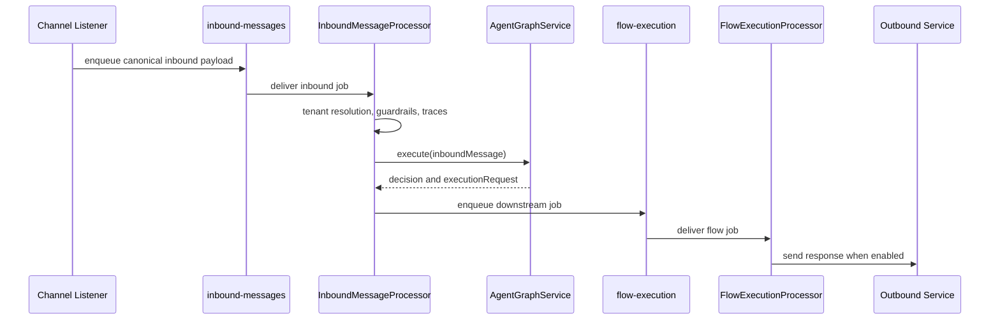

# Runtime Flow

[Home](Home) | [Agent Architecture](Agent-Architecture) | [Channel Integrations](Channel-Integrations)

## Runtime Message Flow

## Current Runtime Roles

- `InboundMessageProcessor`
  - validates inbound jobs
  - resolves tenant context
  - emits metrics and traces
  - calls the graph
  - enqueues the flow-execution stage
- `FlowExecutionProcessor`
  - handles downstream response execution
  - registers documents
  - routes outbound delivery
  - respects safe-mode toggles

Source:

- [docs/ARCHITECTURE.md](/home/cicero/projects/rag-platform/docs/ARCHITECTURE.md)
- [docs/runtime-flow.md](/home/cicero/projects/rag-platform/docs/runtime-flow.md)
