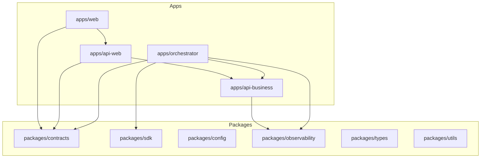

# System Architecture

[Home](Home) | [Runtime Flow](Runtime-Flow) | [Queue Topology](Queue-Topology)

## Monorepo Structure

- `apps/api-web`
  - presentation and BFF NestJS boundary for the portal, document status views, analytics, and operational dashboards
- `apps/api-business`
  - synchronous NestJS API for chat, documents, ingestion, search, conversations, memory, and internal business callbacks
- `apps/web`
  - Next.js application for dashboards, chat views, and omnichannel operator screens
- `apps/orchestrator`
  - asynchronous runtime with listeners, queues, processors, agents, tools, outbound routing, and RabbitMQ document workers

- `packages/contracts`
- `packages/shared`
- `packages/sdk`
- `packages/config`
- `packages/observability`
- `packages/types`
- `packages/utils`

## Boundary Reading

- `api-web` is the presentation boundary for the portal.
- `api-business` is the synchronous business boundary.
- The orchestrator is the real asynchronous runtime.
- The web app consumes `api-web` and does not execute runtime logic.

Source:

- [docs/ARCHITECTURE.md](../ARCHITECTURE.md)
