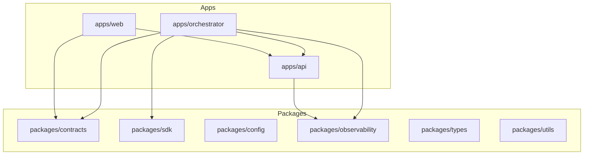

# System Architecture

[Home](Home) | [Runtime Flow](Runtime-Flow) | [Queue Topology](Queue-Topology)

## Monorepo Structure

- `apps/api`
  - synchronous NestJS API for management, analytics, documents, search, memory, health, and admin surfaces
- `apps/web`
  - Next.js application for dashboards, chat views, and omnichannel operator screens
- `apps/orchestrator`
  - asynchronous runtime with listeners, queues, processors, agents, tools, and outbound routing

- `packages/contracts`
- `packages/shared`
- `packages/sdk`
- `packages/config`
- `packages/observability`
- `packages/types`
- `packages/utils`

## Boundary Reading

- The API is a synchronous boundary.
- The orchestrator is the real asynchronous runtime.
- The web app consumes the API and does not execute runtime logic.

Source:

- [docs/ARCHITECTURE.md](/home/cicero/projects/rag-platform/docs/ARCHITECTURE.md)
