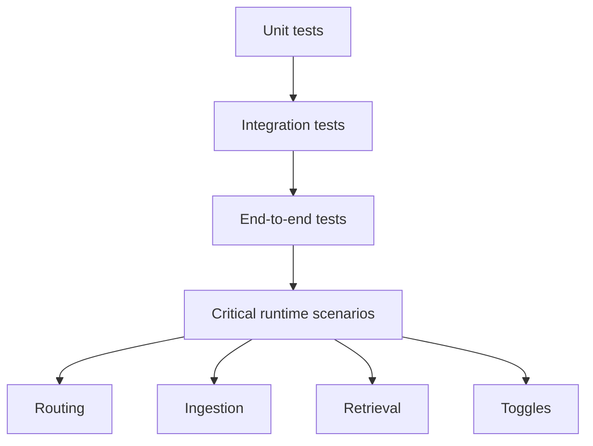

# Testing Strategy

[Home](Home) | [Running Locally](Running-Locally) | [Runtime Flow](Runtime-Flow)

The project includes:

- unit tests
- integration tests
- end-to-end tests for critical flows

Highest-confidence areas today:

- orchestrator critical runtime path
- Telegram-centric runtime behavior
- agent routing
- document ingestion
- RAG retrieval
- feature toggle ON/OFF behavior

## Known Gaps

- stronger end-to-end duplicate event handling
- broader tenant-isolation coverage
- broader API hardening outside the most critical flows

Source:

- [docs/TESTING_GUIDE.md](../TESTING_GUIDE.md)
